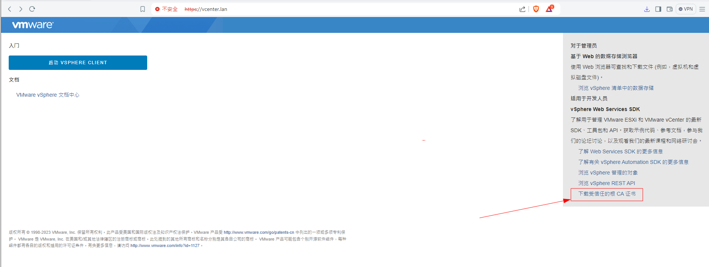
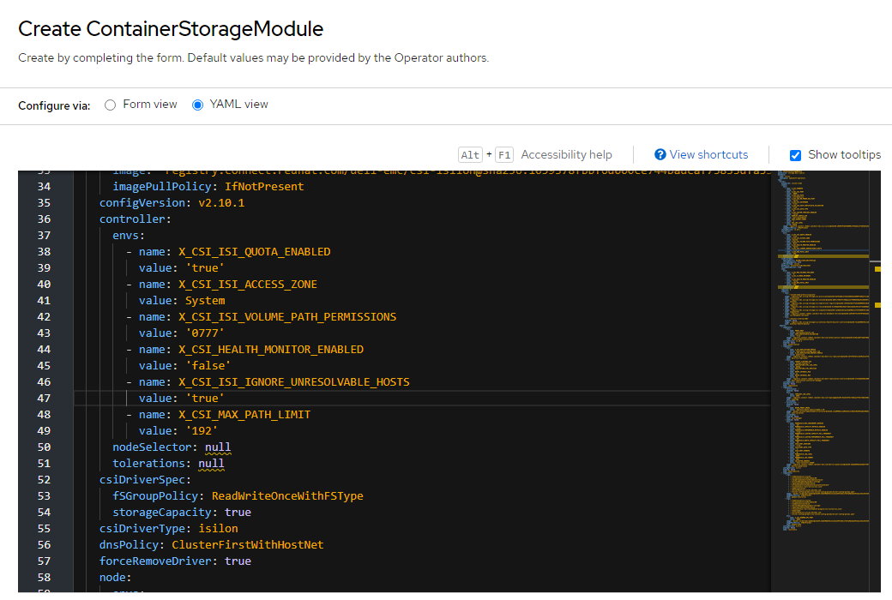
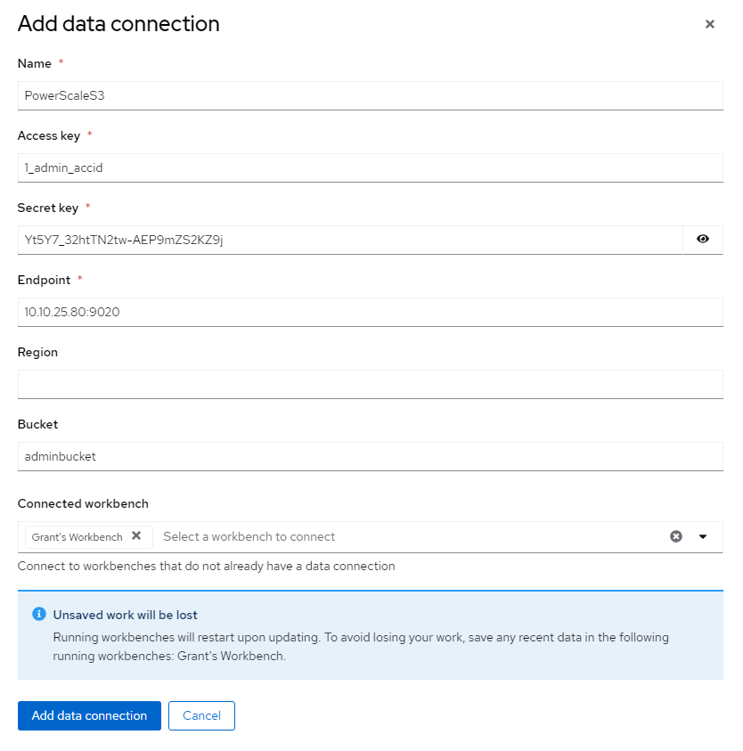
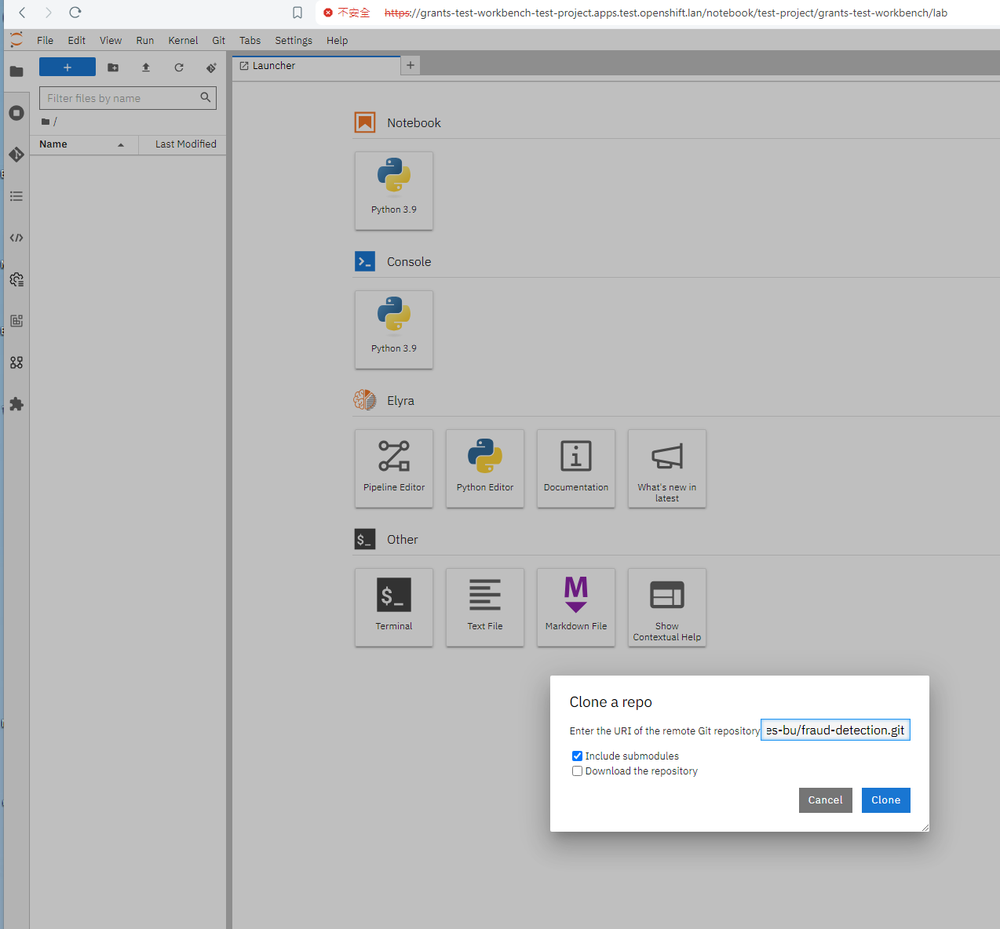
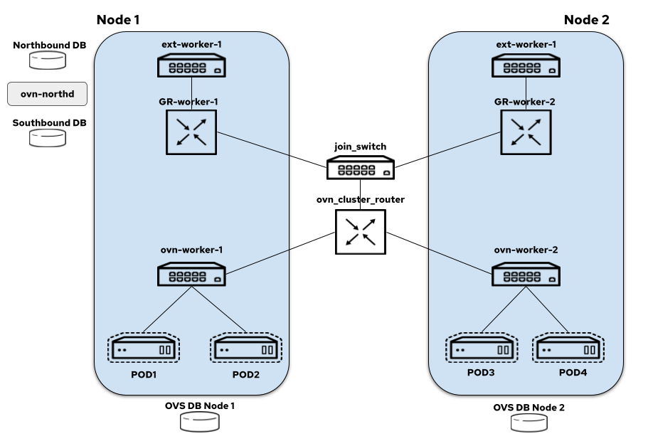

# Build OpenShift

- [Build OpenShift](#build-openshift)
  - [Install](#install)
    - [Set Up Your Local Mirror](#set-up-your-local-mirror)
    - [Using Local Agent](#using-local-agent)
  - [Deploy Dell CSI Operator on OpenShift](#deploy-dell-csi-operator-on-openshift)
  - [Set Up S3](#set-up-s3)
  - [Accessing the System](#accessing-the-system)
    - [Identity Providers](#identity-providers)
  - [Understand OpenShift Networking](#understand-openshift-networking)
    - [Summary of the Mapping](#summary-of-the-mapping)
  - [Helpful Links](#helpful-links)
  - [Dan Notes](#dan-notes)


## Install

### Set Up Your Local Mirror

- Replace the below script with your values and then run it.

```bash
sudo firewall-cmd --add-service=dns --permanent && sudo firewall-cmd --add-port=8443/tcp --permanent && sudo firewall-cmd --add-service=dhcp --permanent && sudo firewall-cmd --reload && sudo firewall-cmd --list-all
wget https://developers.redhat.com/content-gateway/rest/mirror/pub/openshift-v4/clients/mirror-registry/latest/mirror-registry.tar.gz
mkdir -p mirror mirror-registry && tar -xzvf mirror-registry.tar.gz -C ./mirror-registry
cd mirror-registry

# Export the necessary variables
export quayHostname="grant-staging.openshift.lan" # Update me
export quayRoot="/home/grant/mirror/ocp4" # Update me
export quayStorage="/home/grant/mirror/ocp4" # Update me
export pgStorage="/home/grant/mirror/ocp4" # Update me
export initPassword="password" # Update me

# Install the repo
sudo ./mirror-registry install --quayHostname $quayHostname --quayRoot $quayRoot --quayStorage $quayStorage --pgStorage $pgStorage --initPassword $initPassword

# Copy the newly created root CA to the trusted certificate directory
sudo cp $quayRoot/quay-rootCA/rootCA.pem /etc/pki/ca-trust/source/anchors/quayCA.pem

# Update the CA trust
sudo update-ca-trust extract

# Test mirror availability via CLI
podman login -u init -p $initPassword $quayHostname:8443
```
- If everything has gone well up until now you should have a working quay repo:


- Next we have to actually mirror the images. To do this you'll first need to get your pull secret. Download it from [https://console.redhat.com/openshift/install/pull-secret](https://console.redhat.com/openshift/install/pull-secret) to a file at `~/pull-secret.txt`

```bash
# Export variables
export quayHostname="your-quay-host.domain"
export initPassword="your-password"

# Change to home directory
cd ~

# Create ~/.docker directory if it doesn't exist
mkdir -p ~/.docker

# Generate base64-encoded username and password for mirror registry
AUTH=$(echo -n "init:${initPassword}" | base64 -w0)

# Read the original JSON from pull-secret.txt
original_json=$(cat pull-secret.txt)

# Construct the new field to be added
new_field=$(cat <<EOF
"$quayHostname:8443": {
  "auth": "$AUTH"
}
EOF
)

# Modify the JSON to include the new field
modified_json=$(jq --argjson newField "{$new_field}" '.auths += $newField' <<< "$original_json")

# Create the target directory if it does not exist
mkdir -p ~/.docker

# Write the modified JSON to ~/.docker/config.json
echo "$modified_json" > ~/.docker/config.json

echo "The modified JSON has been saved to ~/.docker/config.json"
```

- Next you need to get oc mirror and run it. First you need to log in to RedHat's repo with the below. Make sure you use your redhat username **NOT** your e-mail.

```bash
podman login registry.redhat.io
```

- Next we set up `oc-mirror` itself.
- **WARNING**: I had to disable IPv6 on my interface to get this to work. I got this error because it was trying to use IPv6 to talk to RedHat's repos. I have no idea why, but disabling IPv6 got around this.

```bash
[grant@rockydesktop mirror-registry]$ ../oc-mirror --config=./imageset-config.yaml docker://$quayHostname
Checking push permissions for grant-staging.openshift.lan:8443
Creating directory: oc-mirror-workspace/src/publish
Creating directory: oc-mirror-workspace/src/v2
Creating directory: oc-mirror-workspace/src/charts
Creating directory: oc-mirror-workspace/src/release-signatures
backend is not configured in ./imageset-config.yaml, using stateless mode
backend is not configured in ./imageset-config.yaml, using stateless mode
No metadata detected, creating new workspace
error: error retrieving mapping information for quay.io/openshift-release-dev/ocp-release@sha256:633d1d36e834a70baf666994ef375b9d1702bd1c54ab46f96c41223af9c2d150: unable to retrieve release image info: unable to read image quay.io/openshift-release-dev/ocp-release@sha256:633d1d36e834a70baf666994ef375b9d1702bd1c54ab46f96c41223af9c2d150: Get "https://quay.io/v2/": dial tcp [2600:1f18:483:cf00:69a3:473d:d206:190a]:443: connect: network is unreachable
```

- **WARNING 2:** When I first ran the mirror command it hung here for a long time and I wasn't sure if it had bugged out. I just let it sit and it did end up continuing after several minutes.


- Run the following script.

```bash
# Directory for installation files
install_dir=~/installation-files

# Create the directory if it does not exist
mkdir -p "$install_dir"

# Download and extract oc-mirror
wget https://mirror.openshift.com/pub/openshift-v4/x86_64/clients/ocp/latest/oc-mirror.tar.gz -P "$install_dir"
tar -xzf "$install_dir/oc-mirror.tar.gz" -C "$install_dir"
chmod +x "$install_dir/oc-mirror"
cd ~/installation-files
mkdir -p mirror-registry
cd mirror-registry
cat <<EOF > imageset-config.yaml
kind: ImageSetConfiguration
apiVersion: mirror.openshift.io/v1alpha2
mirror:
  platform:
    channels:
      - name: stable-4.16
        minVersion: 4.16.0
        maxVersion: 4.17.0
  operators:
    - catalog: registry.redhat.io/redhat/redhat-operator-index:v4.16
      packages:
        - name: kubernetes-nmstate-operator
        - name: kubevirt-hyperconverged
        - name: serverless-operator
          channels:
          - name: stable
        - name: local-storage-operator
        - name: odf-operator
        - name: sriov-network-operator
  additionalImages:
    - name: registry.redhat.io/rhel8/support-tools:latest
    - name: registry.redhat.io/ubi8/ubi:latest
  helm: {}
EOF
./oc-mirror --config=./imageset-config.yaml docker://$quayHostname:8443
```

- **IMPORTANT**: Notice that the `oc-mirror` tool creates a folder called `oc-mirror-workspace` and in that folder is a `results-XXXXX` folder. Within the results folder you will need the file `imageContentSourcePolicy.yaml` for later. 

### Using Local Agent

- Installation instructions are located [here](https://docs.openshift.com/container-platform/4.16/installing/installing_with_agent_based_installer/preparing-to-install-with-agent-based-installer.html)

- On the VMWare version you also need the VMWare root certs which you can download from the vCenter home page. Ignore this if you aren't installing on VMWare OR if you are not using VMWare for storage. That is to say, you can install against VMs without doing the VMWare setup. If you do this you should be following the instructions for bare metal **NOT** VMWare.



- Pulling the VMWare certs (don't need to do if not using VMWare or not using VMWare for CSI)

```bash
# For VMWare Version - import certs
sudo cp certs/lin/* /etc/pki/ca-trust/source/anchors
sudo update-ca-trust extract

# Make openshift install directory (if you haven't already)
mkdir ~/openshift-install

# Download the Linux installer and unzip
wget https://mirror.openshift.com/pub/openshift-v4/x86_64/clients/ocp/stable/openshift-install-linux.tar.gz && tar xzf openshift-install-linux.tar.gz

# Make executable
chmod +x ./openshift-install

# Install nmstatectl
sudo dnf install /usr/bin/nmstatectl -y
```

- Next we need to create `agent-config.yaml` and `install-config.yaml`. We'll start with `install-config.yaml`
- My configuration is available at [install-config.yaml](./install-config.yaml). You will need to replace it with your values. For your pull secret, you can use the same information you had in `~/.docker/config.json`. You can run `jq -c . ~/.docker/config.json` to get your pull secret in a single line string.
- Your SSH key you can retrieve from `cat ~/.ssh/id_rsa.pub`
- For `imageContentSources` you may remember earlier that I mentioned the folder results created from `oc-mirror` Go to your results folder and extract the part underneath `repositoryDigestMirrors`. It should look something like the below. That is what needs to go under imageContentSources

```
  - mirrors:
    - grant-staging.openshift.lan:8443/migration-toolkit-virtualization
    source: registry.redhat.io/migration-toolkit-virtualization
  - mirrors:
    - grant-staging.openshift.lan:8443/rhel9
    source: registry.redhat.io/rhel9
  - mirrors:
    - grant-staging.openshift.lan:8443/openshift4
    source: registry.redhat.io/openshift4
  - mirrors:
    - grant-staging.openshift.lan:8443/openshift-serverless-1
    source: registry.redhat.io/openshift-serverless-1
  - mirrors:
    - grant-staging.openshift.lan:8443/container-native-virtualization
    source: registry.redhat.io/container-native-virtualization
***SNIP - there will be more***
```

- For the trust bundle values, you can use the `openssl` tool to extract the certs. You can use the following to get them.
  - **WARNING**: Make sure the certs are all indented correctly in the YAML file.

```bash
openssl s_client -connect <YOUR_QUAY_HOST - EX: grant-staging.openshift.lan>:8443 -showcerts </dev/null 2>/dev/null | \
awk '/BEGIN CERTIFICATE/,/END CERTIFICATE/ {print $0}' > combined-cert-chain.pem
```

- The agent configuration is available [here](./agent-config.yaml). There's no real trick to the agent config, fill it in with your values.
- Once you have filled everything out create a tmp directory to work from and then create the installation files:


```bash
mkdir /tmp/cluster
cd /tmp/cluster/
mv ./agent-config.yaml /tmp/cluster
mv ./install-config.yaml /tmp/cluster
openshift-install agent create cluster-manifests --dir=/tmp/cluster
openshift-install agent create image --dir ./
```

- Now you've generated the ISO, boot your servers with that ISO and enjoy the install.

## Deploy Dell CSI Operator on OpenShift

- I first followed the instructions I wrote for Rancher [here](../PowerScale%20-%20Configure%20with%20Kubernetes/README.md#install_the_csi_driver) to set up the PowerScale side of things.
  - Stop when you get to the settings for K8s.
  - **Make sure you change the path to /ifs/data/csi**. You could change the openshift files, but I found it easier to roll with the default.


- Click on the Dell Container Storage Modules and install it with all the defaults
- After you have it installed, browse to the installed operator and click "Create Instance" on the Container Storage Module


- Go to YAML view and set `X_CSI_ISI_IGNORE_UNRESOLVABLE_HOSTS` to true.



- Create the below secret with the name `empty-secret.yaml` and then create it using `oc`

```bash
[grant@rockydesktop files]$ oc create -f empty-secret.yaml
secret/isilon-certs-0 created
[grant@rockydesktop files]$ cat empty-secret.yaml
apiVersion: v1
kind: Secret
metadata:
  name: isilon-certs-0
  namespace: openshift-operators
type: Opaque
data:
  cert-0: ""
```

- Update the below `secret.yaml` with your data and create it in OpenShift using OC

```yaml
isilonClusters:
    # logical name of PowerScale Cluster
  - clusterName: "powerscale"

    # username for connecting to PowerScale OneFS API server
    # if authorization is enabled, username will be ignored
    # Default value: None
    username: "grant"

    # password for connecting to PowerScale OneFS API server
    # if authorization is enabled, password will be ignored
    password: "password"

    # HTTPS endpoint of the PowerScale OneFS API server
    # if authorization is enabled, the endpont should be the localhost address of the csm-authorization-sidecar
    # Default value: None
    # Examples: "1.2.3.4", "https://1.2.3.4", "https://abc.myonefs.com"
    endpoint: "10.10.25.80"

    # endpointPort: Specify the HTTPs port number of the PowerScale OneFS API server
    # Formerly this attribute was named as "isiPort"
    # If authorization is enabled, endpointPort must match the port specified in the endpoint parameter of the karavi-authorization-config secret
    # Allowed value: valid port number
    # Default value: 8080
    endpointPort: 8080

    # Is this a default cluster (would be used by storage classes without ClusterName parameter)
    # Allowed values:
    #   true: mark this cluster config as default
    #   false: mark this cluster config as not default
    # Default value: false
    isDefault: true

    # Specify whether the PowerScale OneFS API server's certificate chain and host name should be verified.
    # Allowed values:
    #   true: skip OneFS API server's certificate verification
    #   false: verify OneFS API server's certificates
    # Default value: default value specified in values.yaml
    skipCertificateValidation: true

    # The base path for the volumes to be created on PowerScale cluster
    # This will be used if a storage class does not have the IsiPath parameter specified.
    # Ensure that this path exists on PowerScale cluster.
    # Allowed values: unix absolute path
    # Default value: default value specified in values.yaml
    # Examples: "/ifs/data/csi", "/ifs/engineering"
    isiPath: "/ifs/data/csi"

    # The permissions for isi volume directory path
    # This will be used if a storage class does not have the IsiVolumePathPermissions parameter specified.
    # Allowed values: valid octal mode number
    # Default value: "0777"
    # Examples: "0777", "777", "0755"
    # isiVolumePathPermissions: "0777"

    # ignoreUnresolvableHosts: Ignore unresolvable hosts on the OneFS
    # When set to true, OneFS allows new host to add to existing export list though any of the existing hosts from the
    # same exports are unresolvable/doesn't exist anymore.
    # Allowed values:
    #   true: ignore existing unresolvable hosts and append new host to the existing export
    #   false: exhibits OneFS default behavior i.e. if any of existing hosts are unresolvable while adding new one it fails
    # Default value: false
    #ignoreUnresolvableHosts: false

    # Unique ID if the certificate is used to encrypt replication policy
    # This will be used if a replication encrypted is enabled, leave empty in case you use unecrypted replication
    # Allowed values: string, unique id of the certificate
    # Default value: ""
    # Examples: "dd9c736cc17e6dd5f7d85fe13528cfc20f3b4b0af4f26595d22328c8d1f461af"
```

- Create with `oc`. `oc create secret generic isilon-creds -n openshift-operators --from-file=config=secret.yaml`
  - **TODO: I had to use admin because I could not for the life of me figure out how to add the privileges to the grant user**

- On the PowerScale cluster run `isi_gconfig -t web-config auth_basic=true` unless you want to set up a real authentication mechanism.
- For the storage class I went into StorageClasses on OpenShift, created one, edited the YAML, and used:

```yaml
apiVersion: storage.k8s.io/v1
kind: StorageClass
metadata:
  name: isilon
provisioner: csi-isilon.dellemc.com
reclaimPolicy: Delete
allowVolumeExpansion: true
parameters:
  # The name of the access zone a volume can be created in
  # Optional: true
  # Default value: default value specified in values.yaml
  # Examples: System, zone1
  AccessZone: System

  # The base path for the volumes to be created on PowerScale cluster.
  # Ensure that this path exists on PowerScale cluster.
  # Allowed values: unix absolute path
  # Optional: true
  # Default value: value specified in values.yaml for isiPath
  # Examples: /ifs/data/csi, /ifs/engineering
  IsiPath: /ifs/data/csi

  #Parameter to set Advisory Limit to quota
  #Optional: true
  #Default Behaviour : Limit not set
  #AdvisoryLimit: "50"

  #Parameter to set soft limit to quota
  #Optional: true
  #Default Behaviour: Limit not set
  #SoftLimit: "80"

  #Parameter which must be mentioned along with Soft Limit
  #Soft Limit can be exceeded until the grace period
  #Optional: true
  #Default Behaviour : Limit not set
  #SoftGracePrd: "86400"

  # The permissions for isi volume directory path
  # This value overrides the isiVolumePathPermissions attribute of corresponding cluster config in secret, if present
  # Allowed values: valid octal mode number
  # Default value: "0777"
  # Examples: "0777", "777", "0755"
  #IsiVolumePathPermissions: "0777"

  # AccessZone groupnet service IP. Update AzServiceIP if different than endpoint.
  # Optional: true
  # Default value: endpoint of the cluster ClusterName
  #AzServiceIP : 192.168.2.1

  # When a PVC is being created, this parameter determines, when a node mounts the PVC,
  # whether to add the k8s node to the "Root clients" field or "Clients" field of the NFS export
  # Allowed values:
  #   "true": adds k8s node to the "Root clients" field of the NFS export
  #   "false": adds k8s node to the "Clients" field of the NFS export
  # Optional: true
  # Default value: "false"
  RootClientEnabled: "false"

  # Name of PowerScale cluster, where pv will be provisioned.
  # This name should match with name of one of the cluster configs in isilon-creds secret.
  # If this parameter is not specified, then default cluster config in isilon-creds secret
  # will be considered if available.
  # Optional: true
  #ClusterName: <cluster_name>

  # Sets the filesystem type which will be used to format the new volume
  # Optional: true
  # Default value: None
  #csi.storage.k8s.io/fstype: "nfs"

# volumeBindingMode controls when volume binding and dynamic provisioning should occur.
# Allowed values:
#   Immediate: indicates that volume binding and dynamic provisioning occurs once the
#   PersistentVolumeClaim is created
#   WaitForFirstConsumer: will delay the binding and provisioning of a PersistentVolume
#   until a Pod using the PersistentVolumeClaim is created
# Default value: Immediate
volumeBindingMode: Immediate

# allowedTopologies helps scheduling pods on worker nodes which match all of below expressions.
# If enableCustomTopology is set to true in helm values.yaml, then do not specify allowedTopologies
# Change all instances of <ISILON_IP> to the IP of the PowerScale OneFS API server
#allowedTopologies:
#  - matchLabelExpressions:
#      - key: csi-isilon.dellemc.com/<ISILON_IP>
#        values:
#          - csi-isilon.dellemc.com

# specify additional mount options for when a Persistent Volume is being mounted on a node.
# To mount volume with NFSv4, specify mount option vers=4. Make sure NFSv4 is enabled on the Isilon Cluster
#mountOptions: ["<mountOption1>", "<mountOption2>", ..., "<mountOptionN>"]

```

## Set Up S3

- On PowerScale you'll need to enable S3 service and add a bucket


- Install s3cmd with `pip install s3cmd`
- Run `s3cmd --configure`

```bash
Enter new values or accept defaults in brackets with Enter.
Refer to user manual for detailed description of all options.

Access key and Secret key are your identifiers for Amazon S3. Leave them empty for using the env variables.
Access Key [1_admin_accid]:
Secret Key [Yt5Y7_32htTN2tw-AEP9mZS2KZ9j]:
Default Region [US]: ""

Use "s3.amazonaws.com" for S3 Endpoint and not modify it to the target Amazon S3.
S3 Endpoint [http://10.10.25.80:9020]: 10.10.25.80:9020

Use "%(bucket)s.s3.amazonaws.com" to the target Amazon S3. "%(bucket)s" and "%(location)s" vars can be used
if the target S3 system supports dns based buckets.
DNS-style bucket+hostname:port template for accessing a bucket [""]: ''

Encryption password is used to protect your files from reading
by unauthorized persons while in transfer to S3
Encryption password:
Path to GPG program [/usr/bin/gpg]:

When using secure HTTPS protocol all communication with Amazon S3
servers is protected from 3rd party eavesdropping. This method is
slower than plain HTTP, and can only be proxied with Python 2.7 or newer
Use HTTPS protocol [No]:

On some networks all internet access must go through a HTTP proxy.
Try setting it here if you can't connect to S3 directly
HTTP Proxy server name:

New settings:
  Access Key: 1_admin_accid
  Secret Key: Yt5Y7_32htTN2tw-AEP9mZS2KZ9j
  Default Region: ""
  S3 Endpoint: 10.10.25.80:9020
  DNS-style bucket+hostname:port template for accessing a bucket: ''
  Encryption password:
  Path to GPG program: /usr/bin/gpg
  Use HTTPS protocol: False
  HTTP Proxy server name:
  HTTP Proxy server port: 0

Test access with supplied credentials? [Y/n] y
Please wait, attempting to list all buckets...
Success. Your access key and secret key worked fine :-)

Now verifying that encryption works...
Not configured. Never mind.
```

- Add a data connecton on OpenShift AI
  - **WARNING: Screenshot is wrong. For the endpoint YOU MUST PUT HTTP://** This is the opposite of the s3cmd command line where it *won't* work if you add `http://`
  - If you need to troubleshoot pipelines, run `oc get pods -n redhat-ods-applications` to get the name of all your application pods. Then you can ran `oc describe pod openshift-pipelines-operator-69dd8bdfc4-cqxpr -n openshift-operators` (update with your index) to get the pipeline pod logs.



- Setting up a workbench


- `git clone`



## Accessing the System

```bash
[rosa@bastion ~]$ oc login --username cluster-admin --password VEQnI-EBKuH-PHxpY-IPIPE https://api.rosa-mqzmw.r0s7.p3.openshiftapps.com:443
Login successful.

You have access to 78 projects, the list has been suppressed. You can list all projects with 'oc projects'

Using project "default".
Welcome! See 'oc help' to get started.
[rosa@bastion ~]$ oc whoami
cluster-admin
[rosa@bastion ~]$ oc whoami --show-console
https://console-openshift-console.apps.rosa.rosa-mqzmw.r0s7.p3.openshiftapps.com
[rosa@bastion ~]$ 
```

### Identity Providers

- The first time you login you use a temporary admin and then you can add an identity provider:


- I just wanted to do a username/password so I did the below and uploaded the file for htpasswd.

```bash
sudo dnf install -y httpd-tools 
htpasswd -c /home/grant/password grant
```

## Understand OpenShift Networking

From [the docs](https://ovn-kubernetes.io/design/topology/#ovn-kubernetes-network-topology-default-mode) we know there are the following components:



- node-local-switch: all the logical switch ports for the pods created on a node are bound to this switch and it also hosts load balancers that take care of DNAT-ing the service traffic
- distributed-ovn-cluster-router: it's responsible for tunnelling overlay traffic between the nodes and also routing traffic between the node switches and gateway router's
- distributed-join-switch: connects the ovn-cluster-router to the gateway routers
- node-local-gateway-router: it's responsible for north-south traffic routing and connects the join switch to the external switch and it also hosts load balancers that take care of DNAT-ing the service traffic
- node-local-external-switch: connects the gateway router to the external bridge

To this end, I went and pulled the OVS config off of my cluster:

```bash
sudo ovs-vsctl show
b162d944-c8a3-4318-9ebe-b3b1fe2ebc45
    Bridge br-int
        fail_mode: secure
        datapath_type: system
        Port "9d67534f628003c"
            Interface "9d67534f628003c"
        Port "220bd9d34b05ff4"
            Interface "220bd9d34b05ff4"
        Port ccc10faab05e0c3
            Interface ccc10faab05e0c3
        Port "101964cf2513870"
            Interface "101964cf2513870"
        Port "3025424a700befa"
            Interface "3025424a700befa"
        Port fc6b0ac46ee67d0
            Interface fc6b0ac46ee67d0
        Port c682ae728630785
            Interface c682ae728630785
        Port "09e426369137882"
            Interface "09e426369137882"
        Port "42f6eb06e94a8d3"
            Interface "42f6eb06e94a8d3"
        Port "34687c6eadaf73d"
            Interface "34687c6eadaf73d"
        Port "199c158819efdd2"
            Interface "199c158819efdd2"
        Port "325cd19c4cdf788"
            Interface "325cd19c4cdf788"
        Port d32dfbe0d75fd4a
            Interface d32dfbe0d75fd4a
        Port "8c3ea39a75498a7"
            Interface "8c3ea39a75498a7"
        Port br-int
            Interface br-int
                type: internal
        Port "0c7e54c2091f93f"
            Interface "0c7e54c2091f93f"
        Port "4e390191e79cf41"
            Interface "4e390191e79cf41"
        Port "2626d19ab0fee56"
            Interface "2626d19ab0fee56"
        Port d98e9af9aebbf32
            Interface d98e9af9aebbf32
        Port "1b8837f5863d75d"
            Interface "1b8837f5863d75d"
        Port "1b6e5b90ed4e46c"
            Interface "1b6e5b90ed4e46c"
        Port "888b9e7da0e790b"
            Interface "888b9e7da0e790b"
        Port "1fe2b4d9057916c"
            Interface "1fe2b4d9057916c"
        Port c02c20ee9a537fe
            Interface c02c20ee9a537fe
        Port ce68d0e70b72754
            Interface ce68d0e70b72754
        Port c115949c8127c7d
            Interface c115949c8127c7d
        Port "88618dc5d56f9f0"
            Interface "88618dc5d56f9f0"
        Port "51d2137e7b5df4a"
            Interface "51d2137e7b5df4a"
        Port "037619c1e496730"
            Interface "037619c1e496730"
        Port "31e970eaac7dcc7"
            Interface "31e970eaac7dcc7"
        Port "19762a507da7747"
            Interface "19762a507da7747"
        Port "87ffd780e84e11b"
            Interface "87ffd780e84e11b"
        Port "61cba8ea4cf80de"
            Interface "61cba8ea4cf80de"
        Port d1657c3485ebca6
            Interface d1657c3485ebca6
        Port "1b510d8b97b1e72"
            Interface "1b510d8b97b1e72"
        Port "53f53eb9134accf"
            Interface "53f53eb9134accf"
        Port bccb70feea9ed77
            Interface bccb70feea9ed77
        Port "065924fb2665da2"
            Interface "065924fb2665da2"
        Port "90396ed0cecbc13"
            Interface "90396ed0cecbc13"
        Port "5a04215eee12652"
            Interface "5a04215eee12652"
        Port b114337f2e9eb97
            Interface b114337f2e9eb97
        Port "2b01f07c5012e10"
            Interface "2b01f07c5012e10"
        Port "0722cbca14bf74d"
            Interface "0722cbca14bf74d"
        Port "5de0d8d897ed833"
            Interface "5de0d8d897ed833"
        Port fc2033d1a0cf5dc
            Interface fc2033d1a0cf5dc
        Port cc7fb3b50d3f9c1
            Interface cc7fb3b50d3f9c1
        Port "8b9c96d9b27cf6e"
            Interface "8b9c96d9b27cf6e"
        Port "269037e39f92171"
            Interface "269037e39f92171"
        Port "1a3a9538b5d4247"
            Interface "1a3a9538b5d4247"
        Port "433ecc639cdb6b1"
            Interface "433ecc639cdb6b1"
        Port c27ffaecbecde0b
            Interface c27ffaecbecde0b
        Port "845850c4e6cf71b"
            Interface "845850c4e6cf71b"
        Port "7ddb555a4da2886"
            Interface "7ddb555a4da2886"
        Port "733ce64ff827e3b"
            Interface "733ce64ff827e3b"
        Port "2b1b6f84adc9551"
            Interface "2b1b6f84adc9551"
        Port "92dc1017fdf9828"
            Interface "92dc1017fdf9828"
        Port "286aa6ee245a88e"
            Interface "286aa6ee245a88e"
        Port e38c98f5cbc0b80
            Interface e38c98f5cbc0b80
        Port "7ec6321089ae248"
            Interface "7ec6321089ae248"
        Port "07d7a1d8fb17e56"
            Interface "07d7a1d8fb17e56"
        Port "398ea561b912799"
            Interface "398ea561b912799"
        Port "88a6e1c5dfadb3e"
            Interface "88a6e1c5dfadb3e"
        Port "4434f56df4a51d2"
            Interface "4434f56df4a51d2"
        Port ecb6691f061911f
            Interface ecb6691f061911f
        Port "47da0f8eb7c88b4"
            Interface "47da0f8eb7c88b4"
        Port "4c71b7b45b46049"
            Interface "4c71b7b45b46049"
        Port e579198df3b793a
            Interface e579198df3b793a
        Port f5b3469ce8f694e
            Interface f5b3469ce8f694e
        Port bee315fab0230ab
            Interface bee315fab0230ab
        Port de74da61a067ccf
            Interface de74da61a067ccf
        Port "1a696a6b3111d14"
            Interface "1a696a6b3111d14"
        Port abf2eff21ef3887
            Interface abf2eff21ef3887
        Port ovn-k8s-mp0
            Interface ovn-k8s-mp0
                type: internal
        Port "95eb158784dc33b"
            Interface "95eb158784dc33b"
        Port e91b9e2d8740c2f
            Interface e91b9e2d8740c2f
        Port "044e9eb98b6be5c"
            Interface "044e9eb98b6be5c"
        Port f1873deeb7e47aa
            Interface f1873deeb7e47aa
        Port a96b99f80050bcd
            Interface a96b99f80050bcd
        Port ece1db9d37f63c1
            Interface ece1db9d37f63c1
        Port aab86e122f66f97
            Interface aab86e122f66f97
        Port a7f97709f3848a4
            Interface a7f97709f3848a4
        Port "9cfa26213bbcdf6"
            Interface "9cfa26213bbcdf6"
        Port "66b0d1ec2c20052"
            Interface "66b0d1ec2c20052"
        Port "799eb9f534905d9"
            Interface "799eb9f534905d9"
        Port ad3f481a08151c9
            Interface ad3f481a08151c9
        Port "404141d7ef876c5"
            Interface "404141d7ef876c5"
        Port a74eb07b47dc0a7
            Interface a74eb07b47dc0a7
        Port cfa76b640e19418
            Interface cfa76b640e19418
        Port "395b9b684212974"
            Interface "395b9b684212974"
        Port "940c2cf56f9a5f2"
            Interface "940c2cf56f9a5f2"
        Port c8225e494ec809e
            Interface c8225e494ec809e
        Port "7cf4e47fbdcabda"
            Interface "7cf4e47fbdcabda"
        Port "46f6edc707accf3"
            Interface "46f6edc707accf3"
        Port "44bdf69e9f3ef04"
            Interface "44bdf69e9f3ef04"
        Port "42767ccc80b9fc8"
            Interface "42767ccc80b9fc8"
        Port a6f4be438325900
            Interface a6f4be438325900
        Port "2ce5f5875d03c92"
            Interface "2ce5f5875d03c92"
        Port "45648275f0c78d4"
            Interface "45648275f0c78d4"
        Port "2912ae8c3b5c59d"
            Interface "2912ae8c3b5c59d"
        Port "7014d5029019978"
            Interface "7014d5029019978"
        Port "0901bccf4058021"
            Interface "0901bccf4058021"
        Port "0bff3a877f7b5ca"
            Interface "0bff3a877f7b5ca"
        Port d9de58b5f99c22b
            Interface d9de58b5f99c22b
        Port c50854cfe5ac6bc
            Interface c50854cfe5ac6bc
        Port "3bd4ce9ea335726"
            Interface "3bd4ce9ea335726"
        Port "389f7d86664ba25"
            Interface "389f7d86664ba25"
        Port "109dce3614fe9dd"
            Interface "109dce3614fe9dd"
        Port "9563654e13c12d2"
            Interface "9563654e13c12d2"
        Port cf184b7c4426201
            Interface cf184b7c4426201
        Port "3fafaa74deb4b12"
            Interface "3fafaa74deb4b12"
        Port "91e1b1af8d508d7"
            Interface "91e1b1af8d508d7"
        Port da508703ed9e601
            Interface da508703ed9e601
        Port c2460ea21748561
            Interface c2460ea21748561
        Port "53f9225d9e9ef54"
            Interface "53f9225d9e9ef54"
        Port "5f7fe81f1fdfdba"
            Interface "5f7fe81f1fdfdba"
        Port "81e618a95fd3069"
            Interface "81e618a95fd3069"
        Port "670ba81a4b72a8b"
            Interface "670ba81a4b72a8b"
        Port "5f432a944112075"
            Interface "5f432a944112075"
        Port "6ad9dc62b69ee02"
            Interface "6ad9dc62b69ee02"
        Port ddcf3d63a6060c9
            Interface ddcf3d63a6060c9
        Port "04bf81f8d2124d2"
            Interface "04bf81f8d2124d2"
        Port "103c51e6ad82fc0"
            Interface "103c51e6ad82fc0"
        Port bcc59c45a69db0b
            Interface bcc59c45a69db0b
        Port "15c87d27ea1b633"
            Interface "15c87d27ea1b633"
        Port "3da344b00d9e267"
            Interface "3da344b00d9e267"
        Port cdcfaaefeb72b93
            Interface cdcfaaefeb72b93
        Port "063f129ed22d382"
            Interface "063f129ed22d382"
        Port "3edee70301e5d44"
            Interface "3edee70301e5d44"
        Port "44bd2f0bb04e7f6"
            Interface "44bd2f0bb04e7f6"
        Port "96c391a9bcf76d7"
            Interface "96c391a9bcf76d7"
        Port "8e91e05c75a93f9"
            Interface "8e91e05c75a93f9"
        Port "8217fc100d4c064"
            Interface "8217fc100d4c064"
        Port "8d41d82ae32d362"
            Interface "8d41d82ae32d362"
        Port "64e652f8ea80d13"
            Interface "64e652f8ea80d13"
        Port "5b88ebf6f5686f1"
            Interface "5b88ebf6f5686f1"
        Port "4e92fe5b30ce8c1"
            Interface "4e92fe5b30ce8c1"
        Port "64935419185b671"
            Interface "64935419185b671"
        Port "21903391bbc9632"
            Interface "21903391bbc9632"
        Port ba74ec6c39317f1
            Interface ba74ec6c39317f1
        Port "7dcd99ac11fd00e"
            Interface "7dcd99ac11fd00e"
        Port "1f4d6ccb9e915b3"
            Interface "1f4d6ccb9e915b3"
        Port "6a807c99d851d79"
            Interface "6a807c99d851d79"
        Port "7b30cce2e0239d8"
            Interface "7b30cce2e0239d8"
        Port patch-br-int-to-br-ex_b0-7b-25-e9-b2-a4
            Interface patch-br-int-to-br-ex_b0-7b-25-e9-b2-a4
                type: patch
                options: {peer=patch-br-ex_b0-7b-25-e9-b2-a4-to-br-int}
        Port d44a55818594920
            Interface d44a55818594920
        Port "8410c871cfe580c"
            Interface "8410c871cfe580c"
        Port "851c6fbc9ca6c64"
            Interface "851c6fbc9ca6c64"
        Port "0eb976b089880b1"
            Interface "0eb976b089880b1"
        Port "26aa2e08684a6ad"
            Interface "26aa2e08684a6ad"
        Port "2080447b809e4de"
            Interface "2080447b809e4de"
        Port "5ffb83c2457f3a6"
            Interface "5ffb83c2457f3a6"
        Port "79886aca46ee2f8"
            Interface "79886aca46ee2f8"
        Port "6984f72105f858c"
            Interface "6984f72105f858c"
    Bridge br-ex
        Port br-ex
            Interface br-ex
                type: internal
        Port patch-br-ex_b0-7b-25-e9-b2-a4-to-br-int
            Interface patch-br-ex_b0-7b-25-e9-b2-a4-to-br-int
                type: patch
                options: {peer=patch-br-int-to-br-ex_b0-7b-25-e9-b2-a4}
        Port eno1.125
            Interface eno1.125
                type: system
    ovs_version: "3.3.1"
```

Let's relate the components from your `ovs-vsctl show` output to the descriptions in the OVN Kubernetes documentation:

1. **node-local-switch**:
    - **Description**: All the logical switch ports for the pods created on a node are bound to this switch and it also hosts load balancers that take care of DNAT-ing the service traffic.
    - **In my setup**: This corresponds to **`br-int`**. It connects all pod interfaces and manages the internal pod network.
2. **distributed-ovn-cluster-router**:
    - **Description**: Responsible for tunneling overlay traffic between the nodes and also routing traffic between the node switches and gateway routers.
    - **In my setup**: This is represented by **`ovn-k8s-mp0`**. It handles overlay networking and ensures communication between nodes in the cluster via tunnels.
3. **distributed-join-switch** - I don't have this because I did a single node physical build.
4. **node-local-gateway-router**:
    - **Description**: It's responsible for north-south traffic routing and connects the join switch to the external switch and it also hosts load balancers that take care of DNAT-ing the service traffic.
    - **In your setup**: This is likely part of the configuration that connects **`br-int`** to **`br-ex`** through the patch ports. It handles routing traffic from the internal network to the external network.

5. **node-local-external-switch**:
    - **Description**: Connects the gateway router to the external bridge.
    - **In your setup**: This corresponds to **`br-ex`**. It connects to the external network through the physical interface `eno1.125` and facilitates communication between the node and the external network.

### Summary of the Mapping

- **`br-int`**: Functions as the **node-local-switch**, managing internal pod network and connecting various logical interfaces for pods.
- **`ovn-k8s-mp0`**: Acts as part of the **distributed-ovn-cluster-router**, handling overlay traffic between nodes.
- **`br-ex`**: Acts as the **node-local-external-switch**, facilitating external connectivity through `eno1.125`.
- **Patch Ports (`patch-br-int-to-br-ex` and `patch-br-ex-to-br-int`)**: These ports connect `br-int` and `br-ex`, supporting the role of **node-local-gateway-router** in managing north-south traffic routing and connectivity between internal and external networks.

By examining this configuration, you can see how each component of your OVS setup corresponds to the elements described in the OVN Kubernetes documentation, enabling effective network management and traffic routing within your OpenShift cluster.

## Helpful Links

- [Offline Install for VMWare](https://docs.openshift.com/container-platform/4.15/installing/installing_vsphere/upi/installing-restricted-networks-vsphere.html#installing-restricted-networks-vsphere)

## Dan Notes

- There's openshift-installer and there's openshift-installer agent
- The agent installer gets rid of the bootstrap and the loadbalancer
- What the agent-based installer is, is that they containerized everything. In the agent installer you have a rendeveuz node and that's one of your host
- You can put whatever you want for the NIC names. They are completely irrelevant. They're just for matching up in that YAML file. You might need the name in the bond.
- You don't have to have quay.io
- The `openshift-install agent create manifests`
- oc-mirror will write YAML files with the ImageContentSourcePolicy
- You must add your additionaltrustbundlepolicy - you have to change it from proxy only. You need to set this to always
- You have to set AdditionalTrustBundlePolicy