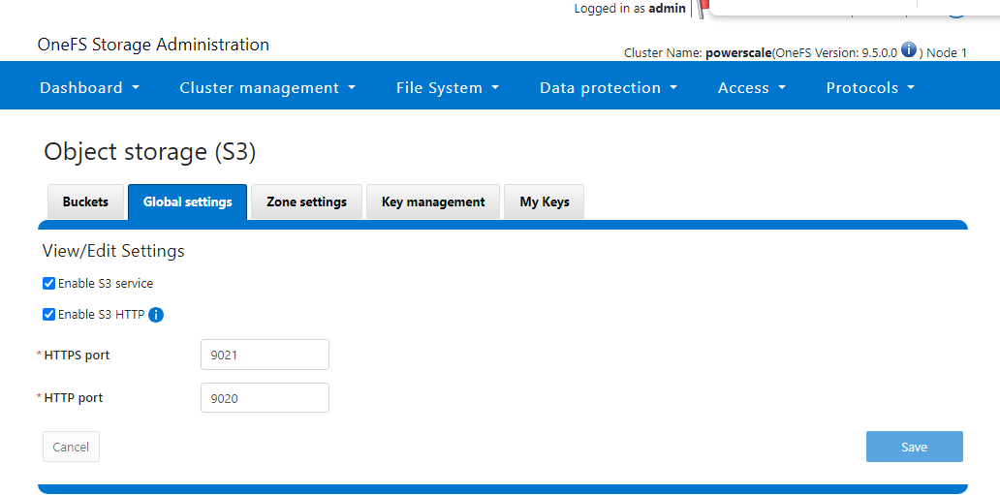
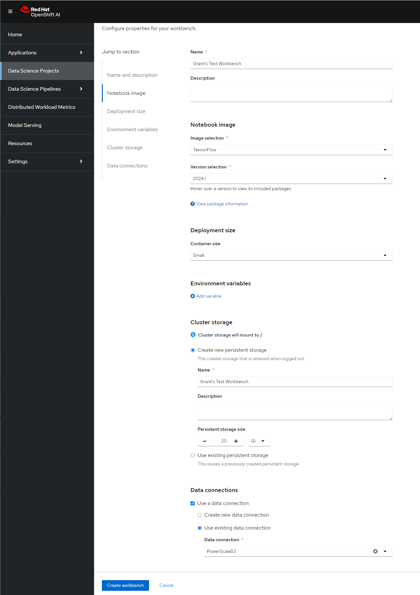

## Helpful Links

- [Offline Install for VMWare](https://docs.openshift.com/container-platform/4.15/installing/installing_vsphere/upi/installing-restricted-networks-vsphere.html#installing-restricted-networks-vsphere)

## Deploy Dell CSI Operator on OpenShift

- I first followed the instructions I wrote for Rancher [here](../PowerScale%20-%20Configure%20with%20Kubernetes/README.md#install_the_csi_driver) to set up the PowerScale side of things.
  - Stop when you get to the settings for K8s.
  - **Make sure you change the path to /ifs/data/csi**. You could change the openshift files, but I found it easier to roll with the default.


- Click on the Dell Container Storage Modules and install it with all the defaults
- After you have it installed, browse to the installed operator and click "Create Instance" on the Container Storage Module


- Go to YAML view and set `X_CSI_ISI_IGNORE_UNRESOLVABLE_HOSTS` to true.


- Create the below secret with the name `empty-secret.yaml` and then create it using `oc`

```bash
[grant@rockydesktop files]$ oc create -f empty-secret.yaml
secret/isilon-certs-0 created
[grant@rockydesktop files]$ cat empty-secret.yaml
apiVersion: v1
kind: Secret
metadata:
  name: isilon-certs-0
  namespace: openshift-operators
type: Opaque
data:
  cert-0: ""
```

- Update the below `secret.yaml` with your data and create it in OpenShift using OC

```yaml
isilonClusters:
    # logical name of PowerScale Cluster
  - clusterName: "powerscale"

    # username for connecting to PowerScale OneFS API server
    # if authorization is enabled, username will be ignored
    # Default value: None
    username: "grant"

    # password for connecting to PowerScale OneFS API server
    # if authorization is enabled, password will be ignored
    password: "password"

    # HTTPS endpoint of the PowerScale OneFS API server
    # if authorization is enabled, the endpont should be the localhost address of the csm-authorization-sidecar
    # Default value: None
    # Examples: "1.2.3.4", "https://1.2.3.4", "https://abc.myonefs.com"
    endpoint: "10.10.25.80"

    # endpointPort: Specify the HTTPs port number of the PowerScale OneFS API server
    # Formerly this attribute was named as "isiPort"
    # If authorization is enabled, endpointPort must match the port specified in the endpoint parameter of the karavi-authorization-config secret
    # Allowed value: valid port number
    # Default value: 8080
    endpointPort: 8080

    # Is this a default cluster (would be used by storage classes without ClusterName parameter)
    # Allowed values:
    #   true: mark this cluster config as default
    #   false: mark this cluster config as not default
    # Default value: false
    isDefault: true

    # Specify whether the PowerScale OneFS API server's certificate chain and host name should be verified.
    # Allowed values:
    #   true: skip OneFS API server's certificate verification
    #   false: verify OneFS API server's certificates
    # Default value: default value specified in values.yaml
    skipCertificateValidation: true

    # The base path for the volumes to be created on PowerScale cluster
    # This will be used if a storage class does not have the IsiPath parameter specified.
    # Ensure that this path exists on PowerScale cluster.
    # Allowed values: unix absolute path
    # Default value: default value specified in values.yaml
    # Examples: "/ifs/data/csi", "/ifs/engineering"
    isiPath: "/ifs/data/csi"

    # The permissions for isi volume directory path
    # This will be used if a storage class does not have the IsiVolumePathPermissions parameter specified.
    # Allowed values: valid octal mode number
    # Default value: "0777"
    # Examples: "0777", "777", "0755"
    # isiVolumePathPermissions: "0777"

    # ignoreUnresolvableHosts: Ignore unresolvable hosts on the OneFS
    # When set to true, OneFS allows new host to add to existing export list though any of the existing hosts from the
    # same exports are unresolvable/doesn't exist anymore.
    # Allowed values:
    #   true: ignore existing unresolvable hosts and append new host to the existing export
    #   false: exhibits OneFS default behavior i.e. if any of existing hosts are unresolvable while adding new one it fails
    # Default value: false
    #ignoreUnresolvableHosts: false

    # Unique ID if the certificate is used to encrypt replication policy
    # This will be used if a replication encrypted is enabled, leave empty in case you use unecrypted replication
    # Allowed values: string, unique id of the certificate
    # Default value: ""
    # Examples: "dd9c736cc17e6dd5f7d85fe13528cfc20f3b4b0af4f26595d22328c8d1f461af"
```

- Create with `oc`. `oc create secret generic isilon-creds -n openshift-operators --from-file=config=secret.yaml`
  - **TODO: I had to use admin because I could not for the life of me figure out how to add the privileges to the grant user**

- On the PowerScale cluster run `isi_gconfig -t web-config auth_basic=true` unless you want to set up a real authentication mechanism.
- For the storage class I went into StorageClasses on OpenShift, created one, edited the YAML, and used:

```yaml
apiVersion: storage.k8s.io/v1
kind: StorageClass
metadata:
  name: isilon
provisioner: csi-isilon.dellemc.com
reclaimPolicy: Delete
allowVolumeExpansion: true
parameters:
  # The name of the access zone a volume can be created in
  # Optional: true
  # Default value: default value specified in values.yaml
  # Examples: System, zone1
  AccessZone: System

  # The base path for the volumes to be created on PowerScale cluster.
  # Ensure that this path exists on PowerScale cluster.
  # Allowed values: unix absolute path
  # Optional: true
  # Default value: value specified in values.yaml for isiPath
  # Examples: /ifs/data/csi, /ifs/engineering
  IsiPath: /ifs/data/csi

  #Parameter to set Advisory Limit to quota
  #Optional: true
  #Default Behaviour : Limit not set
  #AdvisoryLimit: "50"

  #Parameter to set soft limit to quota
  #Optional: true
  #Default Behaviour: Limit not set
  #SoftLimit: "80"

  #Parameter which must be mentioned along with Soft Limit
  #Soft Limit can be exceeded until the grace period
  #Optional: true
  #Default Behaviour : Limit not set
  #SoftGracePrd: "86400"

  # The permissions for isi volume directory path
  # This value overrides the isiVolumePathPermissions attribute of corresponding cluster config in secret, if present
  # Allowed values: valid octal mode number
  # Default value: "0777"
  # Examples: "0777", "777", "0755"
  #IsiVolumePathPermissions: "0777"

  # AccessZone groupnet service IP. Update AzServiceIP if different than endpoint.
  # Optional: true
  # Default value: endpoint of the cluster ClusterName
  #AzServiceIP : 192.168.2.1

  # When a PVC is being created, this parameter determines, when a node mounts the PVC,
  # whether to add the k8s node to the "Root clients" field or "Clients" field of the NFS export
  # Allowed values:
  #   "true": adds k8s node to the "Root clients" field of the NFS export
  #   "false": adds k8s node to the "Clients" field of the NFS export
  # Optional: true
  # Default value: "false"
  RootClientEnabled: "false"

  # Name of PowerScale cluster, where pv will be provisioned.
  # This name should match with name of one of the cluster configs in isilon-creds secret.
  # If this parameter is not specified, then default cluster config in isilon-creds secret
  # will be considered if available.
  # Optional: true
  #ClusterName: <cluster_name>

  # Sets the filesystem type which will be used to format the new volume
  # Optional: true
  # Default value: None
  #csi.storage.k8s.io/fstype: "nfs"

# volumeBindingMode controls when volume binding and dynamic provisioning should occur.
# Allowed values:
#   Immediate: indicates that volume binding and dynamic provisioning occurs once the
#   PersistentVolumeClaim is created
#   WaitForFirstConsumer: will delay the binding and provisioning of a PersistentVolume
#   until a Pod using the PersistentVolumeClaim is created
# Default value: Immediate
volumeBindingMode: Immediate

# allowedTopologies helps scheduling pods on worker nodes which match all of below expressions.
# If enableCustomTopology is set to true in helm values.yaml, then do not specify allowedTopologies
# Change all instances of <ISILON_IP> to the IP of the PowerScale OneFS API server
#allowedTopologies:
#  - matchLabelExpressions:
#      - key: csi-isilon.dellemc.com/<ISILON_IP>
#        values:
#          - csi-isilon.dellemc.com

# specify additional mount options for when a Persistent Volume is being mounted on a node.
# To mount volume with NFSv4, specify mount option vers=4. Make sure NFSv4 is enabled on the Isilon Cluster
#mountOptions: ["<mountOption1>", "<mountOption2>", ..., "<mountOptionN>"]

```

## Set Up S3

- On PowerScale you'll need to enable S3 service and add a bucket



- Install s3cmd with `pip install s3cmd`
- Run `s3cmd --configure`

```bash
Enter new values or accept defaults in brackets with Enter.
Refer to user manual for detailed description of all options.

Access key and Secret key are your identifiers for Amazon S3. Leave them empty for using the env variables.
Access Key [1_admin_accid]:
Secret Key [Yt5Y7_32htTN2tw-AEP9mZS2KZ9j]:
Default Region [US]: ""

Use "s3.amazonaws.com" for S3 Endpoint and not modify it to the target Amazon S3.
S3 Endpoint [http://10.10.25.80:9020]: 10.10.25.80:9020

Use "%(bucket)s.s3.amazonaws.com" to the target Amazon S3. "%(bucket)s" and "%(location)s" vars can be used
if the target S3 system supports dns based buckets.
DNS-style bucket+hostname:port template for accessing a bucket [""]: ''

Encryption password is used to protect your files from reading
by unauthorized persons while in transfer to S3
Encryption password:
Path to GPG program [/usr/bin/gpg]:

When using secure HTTPS protocol all communication with Amazon S3
servers is protected from 3rd party eavesdropping. This method is
slower than plain HTTP, and can only be proxied with Python 2.7 or newer
Use HTTPS protocol [No]:

On some networks all internet access must go through a HTTP proxy.
Try setting it here if you can't connect to S3 directly
HTTP Proxy server name:

New settings:
  Access Key: 1_admin_accid
  Secret Key: Yt5Y7_32htTN2tw-AEP9mZS2KZ9j
  Default Region: ""
  S3 Endpoint: 10.10.25.80:9020
  DNS-style bucket+hostname:port template for accessing a bucket: ''
  Encryption password:
  Path to GPG program: /usr/bin/gpg
  Use HTTPS protocol: False
  HTTP Proxy server name:
  HTTP Proxy server port: 0

Test access with supplied credentials? [Y/n] y
Please wait, attempting to list all buckets...
Success. Your access key and secret key worked fine :-)

Now verifying that encryption works...
Not configured. Never mind.
```

- Add a data connecton on OpenShift AI
  - **WARNING: Screenshot is wrong. For the endpoint YOU MUST PUT HTTP://** This is the opposite of the s3cmd command line where it *won't* work if you add `http://`
  - If you need to troubleshoot pipelines, run `oc get pods -n redhat-ods-applications` to get the name of all your application pods. Then you can ran `oc describe pod openshift-pipelines-operator-69dd8bdfc4-cqxpr -n openshift-operators` (update with your index) to get the pipeline pod logs.


- Setting up a workbench



- `git clone`


## Accessing the System

```bash
[rosa@bastion ~]$ oc login --username cluster-admin --password VEQnI-EBKuH-PHxpY-IPIPE https://api.rosa-mqzmw.r0s7.p3.openshiftapps.com:443
Login successful.

You have access to 78 projects, the list has been suppressed. You can list all projects with 'oc projects'

Using project "default".
Welcome! See 'oc help' to get started.
[rosa@bastion ~]$ oc whoami
cluster-admin
[rosa@bastion ~]$ oc whoami --show-console
https://console-openshift-console.apps.rosa.rosa-mqzmw.r0s7.p3.openshiftapps.com
[rosa@bastion ~]$ 
```

### Identity Providers

- The first time you login you use a temporary admin and then you can add an identity provider:


- I just wanted to do a username/password so I did the below and uploaded the file for htpasswd.

```bash
sudo dnf install -y httpd-tools 
htpasswd -c /home/grant/password grant
```
