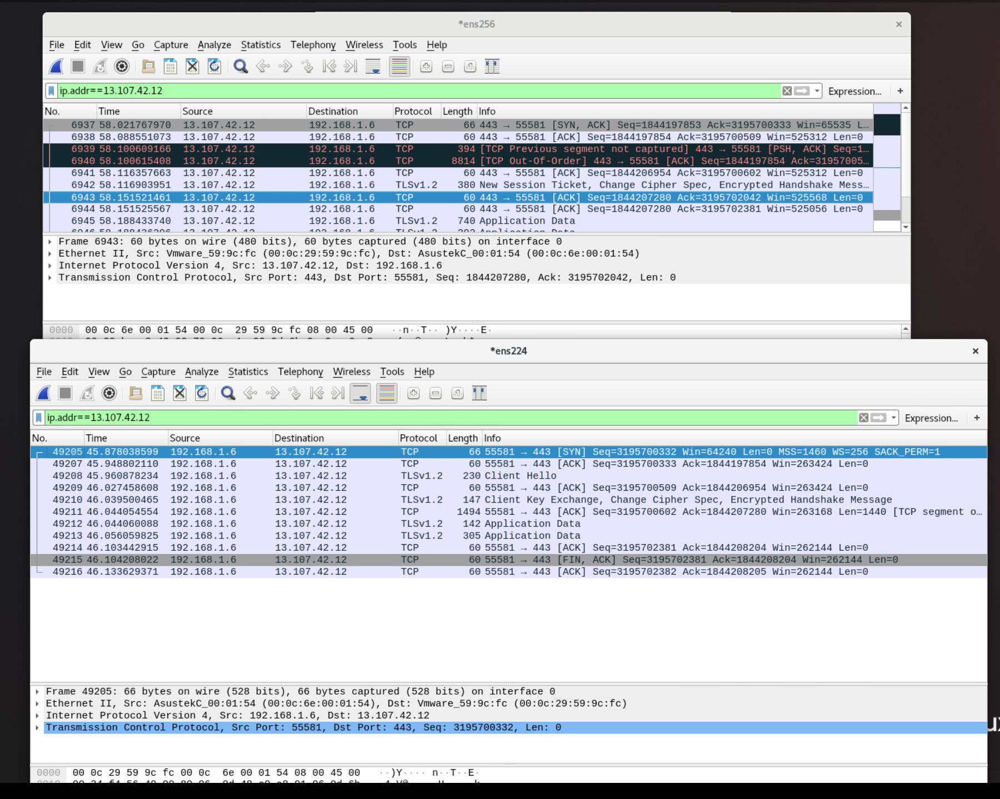
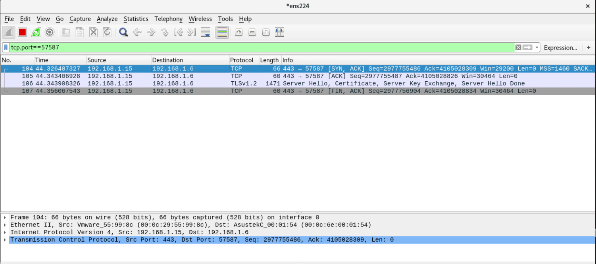

# Dell OS10 Load Balancing with LAG Config

In this test case the goal is to create a simple load balancer using a reverse
LAG port. The idea is to have one input port which is then mirrored to a logical
LAG port and at the other end of the LAG port is a number of security sensors.

After test 3 I added the command:

    OS10(config)# enhanced-hashing resilient-hashing lag

# Helpful Links

[ONIE Network Install Process Overview](https://opencomputeproject.github.io/onie/user-guide/index.html#installing-over-the-network)

[Dell OS10 Manual](https://topics-cdn.dell.com/pdf/networking-s5148f-on_connectivity-guide4_en-us.pdf)

# My Configuration

## General Configuration

- ONIE host is running RHEL 8
- I am using a Dell S4112F-ON for testing
- OS10 10.5.0.2
- PFSense running DNS and DHCP as services

## RHEL Release Info

    NAME="Red Hat Enterprise Linux"
    VERSION="8.0 (Ootpa)"
    ID="rhel"
    ID_LIKE="fedora"
    VERSION_ID="8.0"
    PLATFORM_ID="platform:el8"
    PRETTY_NAME="Red Hat Enterprise Linux 8.0 (Ootpa)"
    ANSI_COLOR="0;31"
    CPE_NAME="cpe:/o:redhat:enterprise_linux:8.0:GA"
    HOME_URL="https://www.redhat.com/"
    BUG_REPORT_URL="https://bugzilla.redhat.com/"

    REDHAT_BUGZILLA_PRODUCT="Red Hat Enterprise Linux 8"
    REDHAT_BUGZILLA_PRODUCT_VERSION=8.0
    REDHAT_SUPPORT_PRODUCT="Red Hat Enterprise Linux"
    REDHAT_SUPPORT_PRODUCT_VERSION="8.0"
    Red Hat Enterprise Linux release 8.0 (Ootpa)
    Red Hat Enterprise Linux release 8.0 (Ootpa)

## OS 10 Version

    OS10# show version
    Dell EMC Networking OS10 Enterprise
    Copyright (c) 1999-2019 by Dell Inc. All Rights Reserved.
    OS Version: 10.5.0.2
    Build Version: 10.5.0.2.468
    Build Time: 2019-10-19T00:29:00+0000
    System Type: S4112F-ON
    Architecture: x86_64
    Up Time: 00:03:39

# Setup ONIE Prerequisites

See [ONIE Install Setup](/README.md#how-to-configure-onie) for instructions.

# Configure Management Interface

See [Configure Management Interface on Dell OS10](/README.md#configure-managment-interface-on-dell-os10)

# Configure Device for LAG

## Physical Configuration

- 1, 1Gb/s copper SFP (Ethernet 1/1/1) for input
- 2, 1Gb/s copper SFPs (Ethernet 1/1/5/Ethernet 1/1/10) and 1, 1Gb/s, fiber SFP (Ethernet 1/1/12) for output

## Configuration

    ! Version 10.5.0.2
    ! Last configuration change at Nov  01 02:25:00 2019
    !
    ip vrf default
    !
    interface breakout 1/1/13 map 100g-1x
    interface breakout 1/1/14 map 100g-1x
    interface breakout 1/1/15 map 100g-1x
    iscsi enable
    iscsi target port 860
    iscsi target port 3260
    system-user linuxadmin password $6$5DdOHYg5$JCE1vMSmkQOrbh31U74PIPv7lyOgRmba1IxhkYibppMXs1KM4Y.gbTPcxyMP/PHUkMc5rdk/ZLv9Sfv3ALtB61
    enhanced-hashing resilient-hashing lag
    username admin password $6$q9QBeYjZ$jfxzVqGhkxX3smxJSH9DDz7/3OJc6m5wjF8nnLD7/VKx8SloIhp4NoGZs0I/UNwh8WVuxwfd9q4pWIgNs5BKH. role sysadmin priv-lvl 15
    aaa authentication login default local
    aaa authentication login console local
    !
    class-map type application class-iscsi
    !
    policy-map type application policy-iscsi
    !
    interface vlan1
    no shutdown
    !
    interface port-channel1
    no shutdown
    switchport access vlan 1
    !
    interface mgmt1/1/1
    no shutdown
    no ip address dhcp
    ip address 192.168.1.20/24
    ipv6 address autoconfig
    !
    interface ethernet1/1/1
    no shutdown
    switchport access vlan 1
    flowcontrol receive on
    !
    interface ethernet1/1/2
    no shutdown
    switchport access vlan 1
    flowcontrol receive on
    !
    interface ethernet1/1/3
    no shutdown
    switchport access vlan 1
    flowcontrol receive on
    !
    interface ethernet1/1/4
    no shutdown
    switchport access vlan 1
    flowcontrol receive on
    !
    interface ethernet1/1/5
    no shutdown
    channel-group 1
    no switchport
    speed 1000
    flowcontrol receive on
    !
    interface ethernet1/1/6
    no shutdown
    switchport access vlan 1
    flowcontrol receive on
    !
    interface ethernet1/1/7
    no shutdown
    switchport access vlan 1
    flowcontrol receive on
    !
    interface ethernet1/1/8
    no shutdown
    switchport access vlan 1
    flowcontrol receive on
    !
    interface ethernet1/1/9
    no shutdown
    switchport access vlan 1
    speed 1000
    flowcontrol receive on
    !
    interface ethernet1/1/10
    no shutdown
    channel-group 1
    no switchport
    speed 1000
    flowcontrol receive on
    !
    interface ethernet1/1/11
    no shutdown
    switchport access vlan 1
    flowcontrol receive on
    !
    interface ethernet1/1/12
    no shutdown
    channel-group 1
    no switchport
    speed 1000
    flowcontrol receive on
    !
    interface ethernet1/1/13
    no shutdown
    switchport access vlan 1
    flowcontrol receive on
    !
    interface ethernet1/1/14
    no shutdown
    switchport access vlan 1
    flowcontrol receive on
    !
    interface ethernet1/1/15
    no shutdown
    switchport access vlan 1
    flowcontrol receive on
    !
    monitor session 1
    destination interface port-channel1
    source interface ethernet1/1/1
    no shut
    !
    snmp-server contact "Contact Support"
    !
    telemetry

# Findings

This time traffic still went to different Wireshark sessions as you can see in the below.

On host 3 you can see the synchronize packet go out with sequence number 3195700332
and you notice that the SYN, ACK response is missing. Look at host 2 and you can see
the SYN, ACK with the expected response of 3195700333.

## Traffic to Different Wireshark Sessions

However a session on host 1 seems to work correctly.

## Host 1 Session with Correct Output

# A More Definitive Test

I wanted to be sure of my findings so I crafted a new PCAP. This time, I started
a capture on my desktop and opened a new connection to vCenter knowing this should
generate several new streams. I then closed the browser entirely to ensure those
same sessions would close.

I then played that back through `tcpreplay`. I then grabbed a random stream from
the sequence to confirm whether I could see the entire three way hand shake on one
host or not.

As suspected the initial syn hit one Wireshark session and the response went to
a separate Wireshark session.

## Host 1

## Host 3

