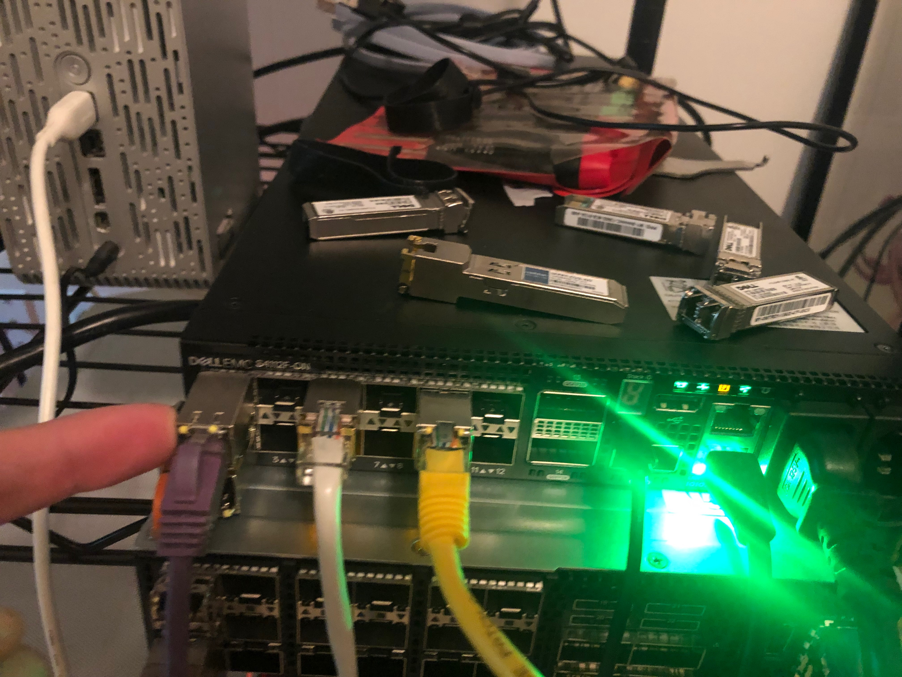
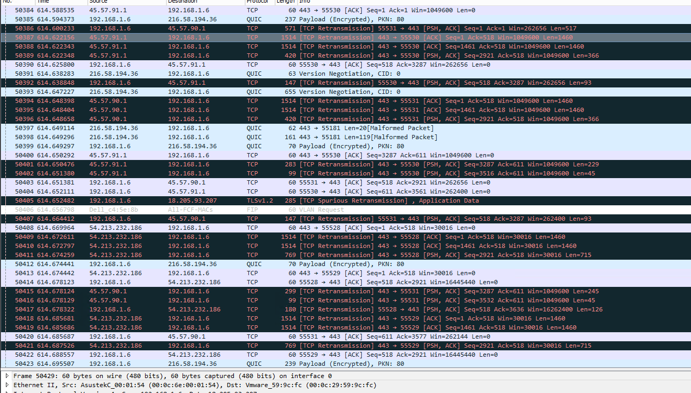
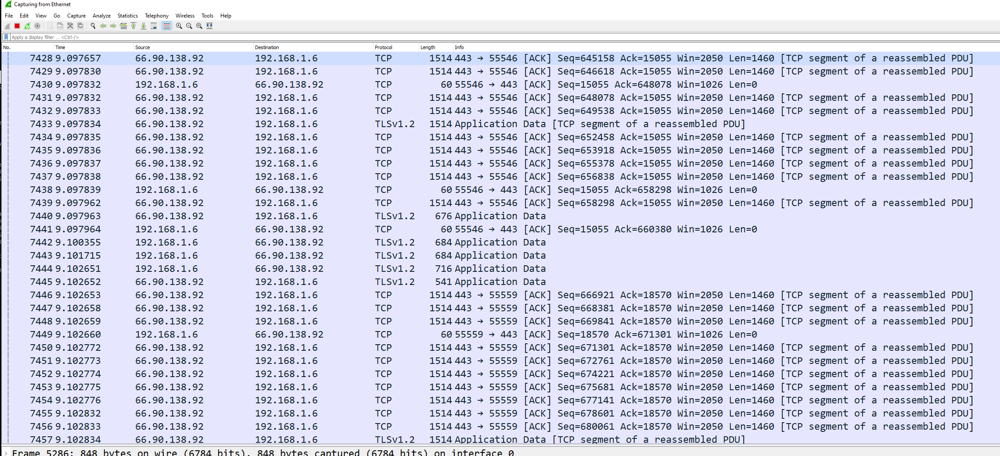
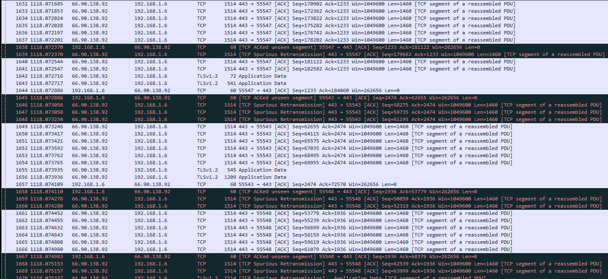
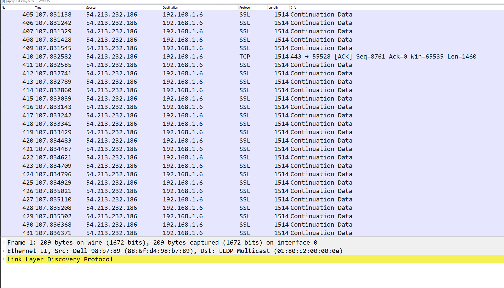

# Multiple Mirror Port Test

In this test case I am testing to see if we can configure a Dell 4112F-ON with
OpenSwitch to create a one to many port configuration using SPAN.

# Helpful Links

[ONIE Network Install Process Overview](https://opencomputeproject.github.io/onie/user-guide/index.html#installing-over-the-network)

[OPX Install Instructions for Dell EMC Equipment](https://github.com/open-switch/opx-docs/wiki/Install-OPX-on-Dell-EMC-ON-series-platforms)

[OPX Tools Source Code](https://github.com/open-switch/opx-tools)

[OPX Command Reference](https://github.com/open-switch/opx-docs/wiki/OPX-commands)

[OPX Docs Home](https://github.com/open-switch/opx-docs/wiki)

[List of Supported Hardware](https://github.com/open-switch/opx-docs/wiki/hardware-support)

# My Configuration

## General Configuration

- ONIE host is running RHEL 8
- I am using a Dell S4112F-ON for testing
- OpenSwitch version PKGS_OPX-3.2.0-installer-x86_64
- PFSense running DNS and DHCP as services

## RHEL Release Info

    NAME="Red Hat Enterprise Linux"
    VERSION="8.0 (Ootpa)"
    ID="rhel"
    ID_LIKE="fedora"
    VERSION_ID="8.0"
    PLATFORM_ID="platform:el8"
    PRETTY_NAME="Red Hat Enterprise Linux 8.0 (Ootpa)"
    ANSI_COLOR="0;31"
    CPE_NAME="cpe:/o:redhat:enterprise_linux:8.0:GA"
    HOME_URL="https://www.redhat.com/"
    BUG_REPORT_URL="https://bugzilla.redhat.com/"

    REDHAT_BUGZILLA_PRODUCT="Red Hat Enterprise Linux 8"
    REDHAT_BUGZILLA_PRODUCT_VERSION=8.0
    REDHAT_SUPPORT_PRODUCT="Red Hat Enterprise Linux"
    REDHAT_SUPPORT_PRODUCT_VERSION="8.0"
    Red Hat Enterprise Linux release 8.0 (Ootpa)
    Red Hat Enterprise Linux release 8.0 (Ootpa)

## OPX Version

    OS_NAME="OPX"
    OS_VERSION="unstable"
    PLATFORM="S4112F-ON"
    ARCHITECTURE="x86_64"
    INTERNAL_BUILD_ID="OpenSwitch blueprint for Dell 1.0.0"
    BUILD_VERSION="unstable.0-stretch"
    BUILD_DATE="2019-06-21T19:04:22+0000"
    INSTALL_DATE="2019-10-23T23:16:10+00:00"
    SYSTEM_UPTIME= 1 day, 5 minutes
    SYSTEM_STATE= running
    UPGRADED_PACKAGES=no
    ALTERED_PACKAGES=yes

Wasn't sure why I got the unstable version after installation. It didn't cause any
problems for testing so I just left it as is.

# Setup ONIE Prerequisites

I ran the network version of the ONIE installation using a web server. Below
is what I did to get things installed. We will host the OS installer on our
web server and then we will use ONIE to grab it. We will use a DNS record to 
control the ONIE server location.

1. Install Apache on RHEL or your favorite Linux distro.
2. Make sure you allow HTTP traffic through the firewall
3. Download Open Switch [here](http://archive.openswitch.net/).
4. Upload `PKGS_OPX-3.2.0-installer-x86_64.bin` to the root of your web server.
5. Create a symlink to the installer with `ln -s PKGS_OPX-3.2.0-installer-x86_64.bin onie-installer`. The file must have this name for the installation to work.
6. The switch will use DHCP to acquire an IP address. On the DNS server pointed to by your DHCP configuration, add a record for onie-server and point it at the host running Apache.

On a test box, run a DHCP request, ensure you pull the correct DNS server and that the host can resolve `onie-server`. After you confirm DNS is working, browse to the onie-installer file
on your Apache server and make sure you can download it without issue.

**Warning:** It must be able to resolve the hostname onie-server with the FQDN.
If `onie-server` is not immediately resolvable, the install process will not work.

# ONIE Boot the Switch

1. Connect to the switch over the console port. My configuration was:

        Baud Rate: 115200
        Data Bits: 8
        Stop Bits: 1
        Parity: None
        Flow Control: None

2. Connect the ethernet management port of the switch to the same network containing your web server. ONIE will use the management port to establish a connection to the ONIE server.
3. Once the grub menu appears, select ONIE Installer. In my case this was the top option.
4. At this point the ONIE discovery process will commence. It will print each location it attempts to search. It should find the onie-server DNS record and the installation should begin automatically. If this doesn't happen it means there is an issue with the preconfiguration above. Try swapping out the ethernet management cable with a host. Make sure that host pulls DNS/DHCP correctly and is able to download the onie-installer file.
5. Wait for the installation to finish and the switch to reboot. Login with admin/admin.

# Configure Management Interface

**Update:** After I got it working I ended up using this as an ingress interface
so this step is more or less optional. You won't be able to SSH into this interface
in the end config (at least not easily).

1. Start by running `sudo -i` to move to privileged mode. **Warning:**  I noticed the OPX command line tools won't behave correctly unless you are privileged. Ex: `opx-show-interface` won't list any interfaces.
2. I added vim to my box before continuing with `sudo apt-get install -y vim`
3. The management interface is configured like a typicaly Debian interface with `vim /etc/network/interface.d/eth0`
4. Use the following configuration modified to your needs:

        auto eth0
        allow-hotplug eth0
        iface eth0 inet static
            address 192.168.1.20
            netmask 255.255.255.0
            gateway 192.168.1.1

5. When you are finished with your configuration run `systemctl restart networking` to apply the changes.
6. Confirm the changes were applied with `ip address show dev eth0`. If you see two IP addresses because you picked one up from DHCP you can delete the other with `ip address del [IP ADDRESS] dev eth0` and then run `systemctl restart networking`

At this juncture your management interface should be up and running and you should
be able to SSH to it. I went ahead and swapped to SSH so as not to deal with the
oddities that come with running in the console port.

# My Testing

## Attempt 1 - Mirror Ports

My first go is to try using OpenSwitch's built in mirroring capability.

### Physical Configuration

I didn't have enough target hosts to try outputting from one port to all ports so
I simulated it. The purple cable in the image is the input port from the traffic
generator (tcpreplay) and the white and yellow cables go out to the hosts listed
as host 1 and host 2 in the test results section. The ports with the white and yellow
cables were configured as the mirror's target ports.

### Mirror Configuration

For each port you want to mirror to run `opx-config-mirror create --src_intf e101-001-0 --dest_intf e101-005-0 --direction ingress --type span`. Substitute your source and destination ports appropriately.

### Results

#### Mirror Port Failure After 4

I was only able to get this to work on up to 4 ports. After that I received errors.
See output below:

    root@OPX:~# opx-config-mirror create --src_intf e101-001-0 --dest_intf e101-005-0 --direction ingress --type span
    root@OPX:~# ip link set e101-009-0 up
    root@OPX:~# opx-config-mirror create --src_intf e101-001-0 --dest_intf e101-009-0 --direction ingress --type span
    root@OPX:~# opx-config-mirror create --src_intf e101-001-0 --dest_intf e101-002-0 --direction ingress --type span
    root@OPX:~# opx-config-mirror create --src_intf e101-001-0 --dest_intf e101-003-0 --direction ingress --type span
    root@OPX:~# opx-config-mirror create --src_intf e101-001-0 --dest_intf e101-004-0 --direction ingress --type span
    {'data': {'base-mirror/entry/dst-intf': bytearray(b'\x0f\x00\x00\x00'), 'base-mirror/entry/type': bytearray(b'\x01\x00\x00\x00'), 'base-mirror/entry/intf': {'0': {'base-mirror/entry/intf/src': bytearray(b'\x0c\x00\x00\x00'), 'base-mirror/entry/intf/direction': bytearray(b'\x01\x00\x00\x00')}}}, 'key': '1.27.1769488.1769473.'}
    opx-config-mirror: Commit failed
    root@OPX:~# opx-config-mirror create --src_intf e101-001-0 --dest_intf e101-006-0 --direction ingress --type span
    {'data': {'base-mirror/entry/dst-intf': bytearray(b'\x11\x00\x00\x00'), 'base-mirror/entry/type': bytearray(b'\x01\x00\x00\x00'), 'base-mirror/entry/intf': {'0': {'base-mirror/entry/intf/src': bytearray(b'\x0c\x00\x00\x00'), 'base-mirror/entry/intf/direction': bytearray(b'\x01\x00\x00\x00')}}}, 'key': '1.27.1769488.1769473.'}
    opx-config-mirror: Commit failed
    root@OPX:~# opx-config-mirror create --src_intf e101-001-0 --dest_intf e101-007-0 --direction ingress --type span
    {'data': {'base-mirror/entry/dst-intf': bytearray(b'\x12\x00\x00\x00'), 'base-mirror/entry/type': bytearray(b'\x01\x00\x00\x00'), 'base-mirror/entry/intf': {'0': {'base-mirror/entry/intf/src': bytearray(b'\x0c\x00\x00\x00'), 'base-mirror/entry/intf/direction': bytearray(b'\x01\x00\x00\x00')}}}, 'key': '1.27.1769488.1769473.'}
    opx-config-mirror: Commit failed

Pretty printed version for ease of reading:

    {
    'data': {
        'base-mirror/entry/dst-intf': bytearray(b '\x12\x00\x00\x00'),
        'base-mirror/entry/type': bytearray(b '\x01\x00\x00\x00'),
        'base-mirror/entry/intf': {
        '0': {
            'base-mirror/entry/intf/src': bytearray(b '\x0c\x00\x00\x00'),
            'base-mirror/entry/intf/direction': bytearray(b '\x01\x00\x00\x00')
        }
        }
    },
    'key': '1.27.1769488.1769473.'
    }

#### Functioning Mirror Ports

Before I caught the error, I did test the first two mirror ports I made and they
worked as expected. See the below.

I used tcpreplay with some traffic I captured on my desktop to test the idea. I
just uploaded the PCAP and replayed it with `tcpreplay -i ens224 ./test_pcap.pcap --loop 500`

I then confirmed that all target ports received traffic. See screenshots below:

### Host 1

### Host 2

The host I collected the traffic on was 192.168.1.6 and as you can see from the 
images both hosts were able to see traffic from the tcpreplay session.

## Attempt 2 - tc

### Configuration

`tc` is a feature of modern Linux kernels designed for mirroring traffic. I found
[this](https://davidwaiting.com/using-linux-tc-for-traffic-mirroring/) article
helpful. [This Mellanox article](https://github.com/Mellanox/mlxsw/wiki/Port-Mirroring) was also
useful.

1. The first thing I did was create an ingress queue on my input interface with `tc qdisc add dev e101-001-0 handle ffff: ingress`
   1. If you need to delete a qdisc you can do it with `tc qdisc del dev e101-001-0 [ root | ingress ]`
2. Double check your queue with handle ffff was created with `tc -s qdisc ls dev e101-001-0`
3. Next we want to mirror all traffic from the ingress port to an output port with `tc filter add dev e101-001-0 parent ffff: protocol all u32 match u32 0 0 action mirred egress mirror dev e101-005-0`
4. Check that your port mirror appeared in the config with `tc -s -p filter ls dev e101-001-0 parent ffff:`
   1. If you need to delete the filters you can do so with `tc filter del dev e101-001-0 parent ffff:`
5. Set queue to not shape traffic with `tc qdisc add dev e101-001-0 handle 1: root prio`

#### Alternate Configuration

I tried instead running:

1. `tc qdisc add dev e101-001-0 clsact`
2. `tc filter add dev e101-001-0 ingress matchall skip_sw action mirred egress mirror dev e101-005-0`

#### Other Things Tried

Haven't been able to figure out why just yet, but only Layer 2 traffic is making
it through the port mirror. Everything above gets dropped. 

I thought maybe it was MAC address learning, but the problem persisted when I ran `opx-config-global-switch --mac-age-time 0`

I also thought that it was the port not being set to promiscuous mode so I gave it `ifconfig e101-001-0 promisc`.
That didn't work either.

### Conclusions

I'm pretty confident that because this is a network OS for switching something
funky is going on. Ex: When you run a port mirror, all the traffic passes correctly,
but you won't see any of that traffic on a tcpdump session. Need to study up on the
architecture. I'm pretty sure there's a way to make this particular tactic work,
but for time's sake I'm going to try something else.

## Attempt 3  - tc on Management Interface

I realized something is going on with the forwarding tables on the switch at a low
level that was intercepting our traffic in attempt 2. That said, I noticed that
the management interface for the switch effectively works like a standard Linux 
interface. I did the same thing I did in attempt 2 except I used the managament
interface instead of one of the other interfaces.

### Results

The switch accepts the config. However, the traffic only goes out to one port
at a time.

## Attempt 4 (Working Solution) - tc on Management Interface with a Bridge

### Physical Configuration

As mentioned in attempt 3, I used the management interface is the ingress port for
mirroring.

### Bridge/tc Configuration

After attempt 3 I started thinking about other ways to connect things. Realized
I could just pump everything to a bridge and let that do the replication. That worked!

Do the following to get it up and running:

`tc` is a feature of modern Linux kernels designed for mirroring traffic. I found
[this](https://davidwaiting.com/using-linux-tc-for-traffic-mirroring/) article
helpful. [This Mellanox article](https://github.com/Mellanox/mlxsw/wiki/Port-Mirroring) was also
useful.

**WARNING:** You must use your management interface for the ingress port or this
solution will not work! I noticed the other ports do not behave like normal Linux
ports. More investigation required to figure out the difference.

1. Create a bridge interface with `brctl addbr br0`
2. Attach all interfaces you want as part of the port mirroring to the bridge with `brctl addif br0 <INTERFACE>`
3. Disable MAC address learning on the bridge with `brctl setageing br0 0`
4. The first thing I did was create an ingress queue on my input interface with `tc qdisc add dev < MGMT_INTERFACE > handle ffff: ingress`
   1. If you need to delete a qdisc you can do it with `tc qdisc del dev < MGMT_INTERFACE > [ root | ingress ]`
5. Double check your queue with handle ffff was created with `tc -s qdisc ls dev < MGMT_INTERFACE >`
6. Next we want to mirror all traffic from the ingress port to an output port with `tc filter add dev < MGMT_INTERFACE > parent ffff: protocol all u32 match u32 0 0 action mirred egress mirror dev br0`
7. Check that your port mirror appeared in the config with `tc -s -p filter ls dev < MGMT_INTERFACE > parent ffff:`
   1. If you need to delete the filters you can do so with `tc filter del dev < MGMT_INTERFACE > parent ffff:`
8. Set queue to not shape traffic with `tc qdisc add dev < MGMT_INTERFACE > handle 1: root prio`

### Things I Tried

- I added 7 interfaces to my bridge to make sure there weren't any strange limitations
- I moved the SFPs around to multiple different ports to make sure the traffic was mirroing on all of them
- I double checked the traffic I was capturing belonged to the PCAP in question. Easy enough to see because it has IP addresses the hosts in question wouldn't ever otherwise see. Screenshots for confirmation below.
### Host 1

### Host 2

- I checked that pure L3 traffic was passed correctly using ICMP.
  

### Noted Problem

The only major issue I noticed is that pure layer 2 traffic didn't get passed. Haven't
figured out how to fix that yet.

