# Notes on vSAN

- [Notes on vSAN](#notes-on-vsan)
  - [Disk Groups](#disk-groups)
  - [Deduplication and Replication](#deduplication-and-replication)
  - [Distributed Datastore](#distributed-datastore)
  - [Objects Components and Witnesses](#objects-components-and-witnesses)
  - [RAID Architecture](#raid-architecture)
  - [Required Networks](#required-networks)
  - [Quarum Logic](#quarum-logic)
    - [Fault Domains](#fault-domains)
      - [Sample Architecture](#sample-architecture)
  - [Witness](#witness)
  - [Design Notes](#design-notes)
    - [Networking](#networking)
    - [Erasure Coding](#erasure-coding)
      - [RAID 5](#raid-5)
      - [RAID 6](#raid-6)
    - [Internal Components](#internal-components)

## Disk Groups
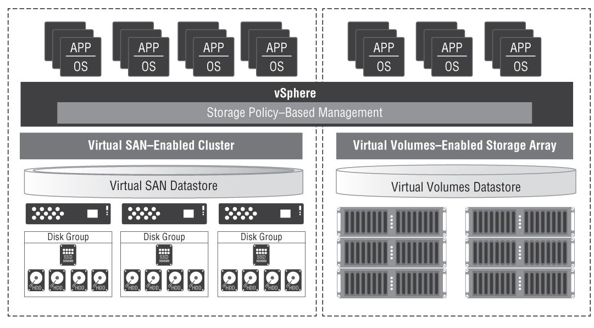

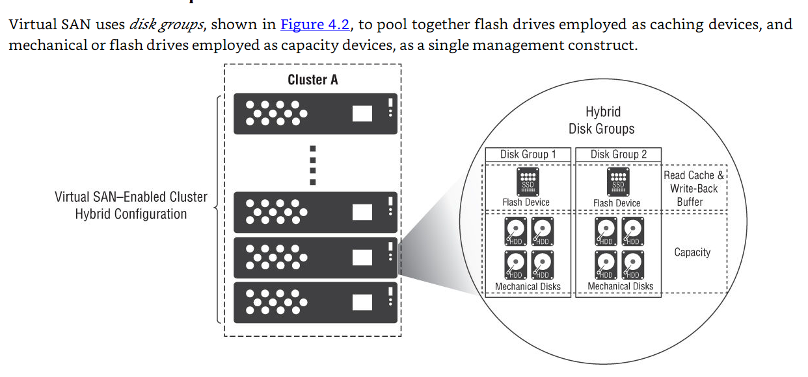

## Deduplication and Replication

- The scope of deduplication and compression exists only within each disk group.
  - Hosken, Martin. VMware Software-Defined Storage (Kindle Locations 5278-5279). Wiley. Kindle Edition. 

- Virtual SAN uses a distributed read cache mechanism whereby reads and writes are distributed to all hosts holding replicas. This way, if one host is busy, the other hosts holding replicas can still service I/ O requests.
  - Hosken, Martin. VMware Software-Defined Storage (Kindle Locations 5317-5318). Wiley. Kindle Edition. 

- Virtual SAN locates data in two or more locations across the distributed Virtual SAN datastore, in order to withstand host or disk failures. With data locality operating in this way, I/ O can come from any of the data replicas across the cluster, helping to mitigate potential host or disk bottlenecks and allowing Virtual SAN to run more efficiently, while still maintaining data availability and optimum performance.
  - Hosken, Martin. VMware Software-Defined Storage (Kindle Locations 5324-5327). Wiley. Kindle Edition. 

- The mechanism for destaging differs between the two Virtual SAN models, hybrid and all-flash; mechanical disks are typically good at handling sequential write workloads, so Virtual SAN uses this to make the process more efficient. In the hybrid model, an elevator algorithm runs independently on each disk group and decides, locally, whether to move any data to its capacity disks, and if so, when. This algorithm uses multiple criteria and batches together larger chunks of data that are physically proximal on a mechanical disk, and destages them together asynchronously. This mechanism writes to the disk sequentially for improved performance. However, the destaging mechanism is also conservative: it will not rush to move data if the space in the write buffer is not constringed. In addition, as data that is written tends to be overwritten quickly within a short period of time, this approach avoids writing the same blocks of data multiple times to the mechanical disks. Also note that the write buffers of the capacity layer disks are flushed onto the persistent storage devices before writes are discarded from the caching device. In the all-flash model, Virtual SAN uses 100 percent of the available capacity on the endurance flash device as a write buffer. In all-flash configurations, essentially the same mechanism is in place as that in the hybrid model. However, Virtual SAN does not take into account the proximal algorithm, making it a more efficient mechanism for destaging to capacity flash devices. Also, in the all-flash model, changes to the elevator algorithm allow the destaging of cold data from the write cache to the capacity tier, based on their data blocks' relative hotness or coldness. In addition, data blocks that are overwritten stay in the caching tier longer, which results in reducing the overall wear on the capacity tier flash devices, increasing their life expectancy.
  - Hosken, Martin. VMware Software-Defined Storage (Kindle Locations 5339-5353). Wiley. Kindle Edition.

## Distributed Datastore

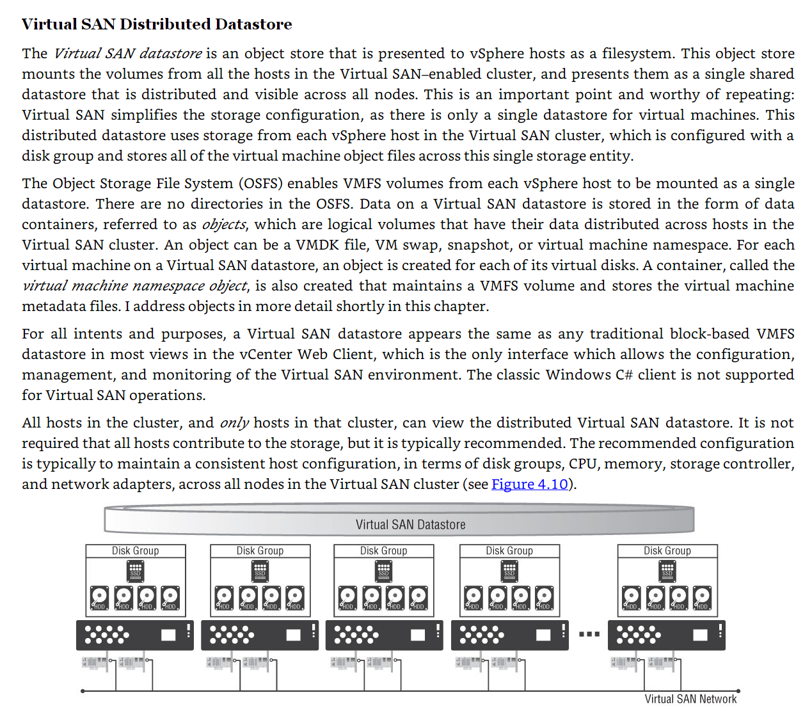

## Objects Components and Witnesses

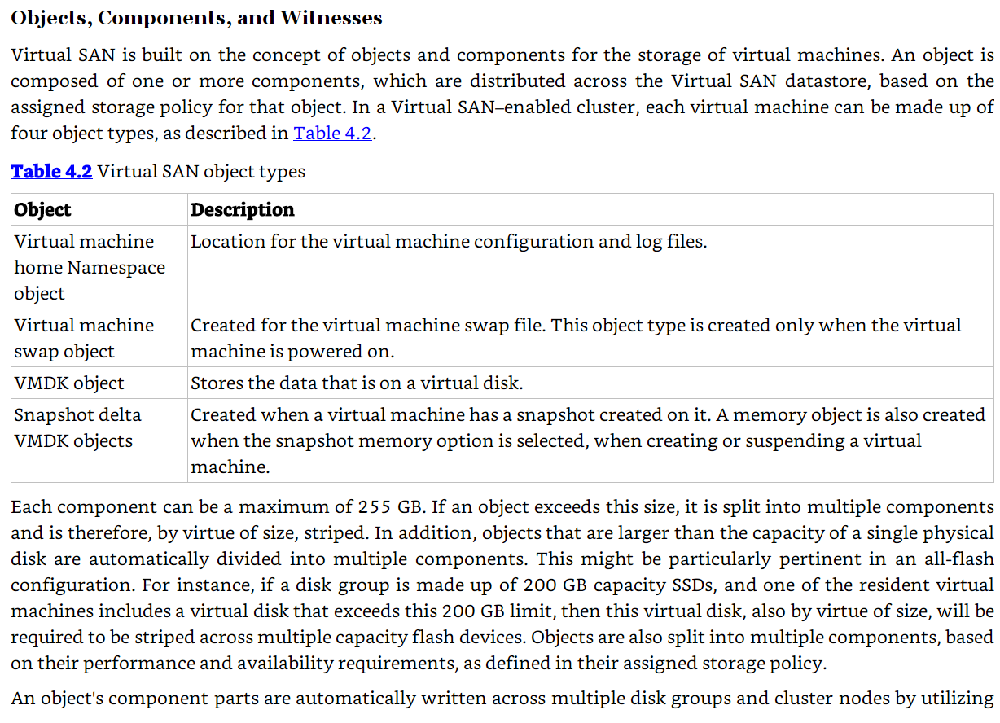

## RAID Architecture

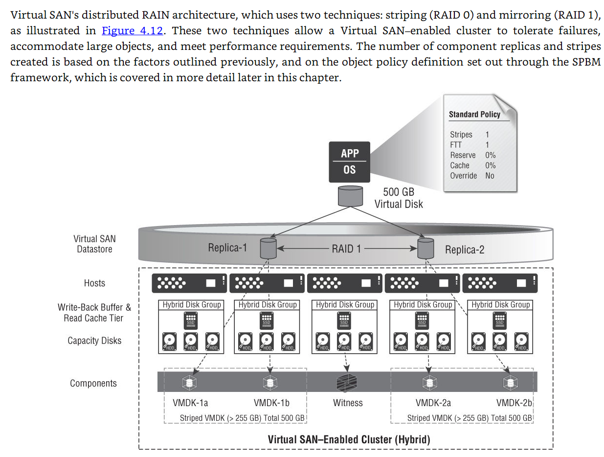

## Required Networks

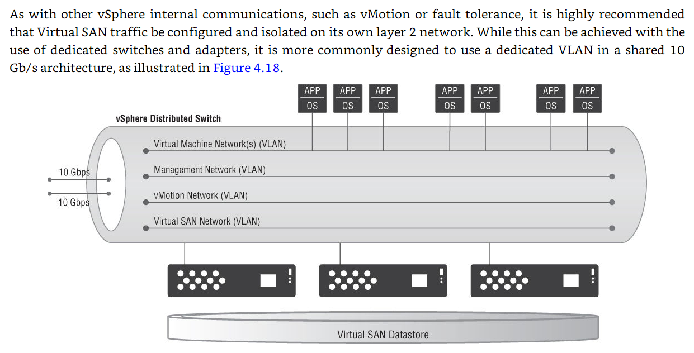

## Quarum Logic

- A Virtual SAN– enabled cluster uses a quorum-based system with witness components to ensure consistent operations across the distributed datastore. The quorum is the minimum number of votes that a distributed system must be able to obtain, in order to be allowed to perform an operation. In Virtual SAN, 50 percent of the votes that make up a virtual machine's storage object must be accessible at all times for that replica to be active. If less than 50 percent of the votes are accessible to the host, the object is not available and is marked as inaccessible in the Virtual SAN datastore. This can become a problem for Virtual SAN that can affect the availability of virtual machines, if after a host failure, the loss of quorum for a virtual machine object results in vSphere High Availability not being able to restart the virtual machine until the cluster quorum is restored. vSphere HA can guarantee that a virtual machine will restart only when it has a cluster quorum and can access the most recent copy of the virtual machine object. For instance, Figure 4.48 shows a three-node cluster that has a single virtual machine running on host 1, which has been assigned a storage policy with an FTT (Failures to Tolerate) of 1. If all three hosts fail in sequence (with host 3 the last host to fail), when host 1 and host 2 come back online, vSphere HA will be unable to restart the virtual machine because the last host that failed, host 3, retains the most recent copy of the virtual machine object components and is currently inaccessible. In this scenario, either all three hosts must recover at the same time or the two-host quorum must include host 3. If neither of these conditions is satisfied, vSphere High Availability will attempt to restart the virtual machine again when host 3 comes back online.
  - Hosken, Martin. VMware Software-Defined Storage (p. 302). Wiley. Kindle Edition. 

### Fault Domains

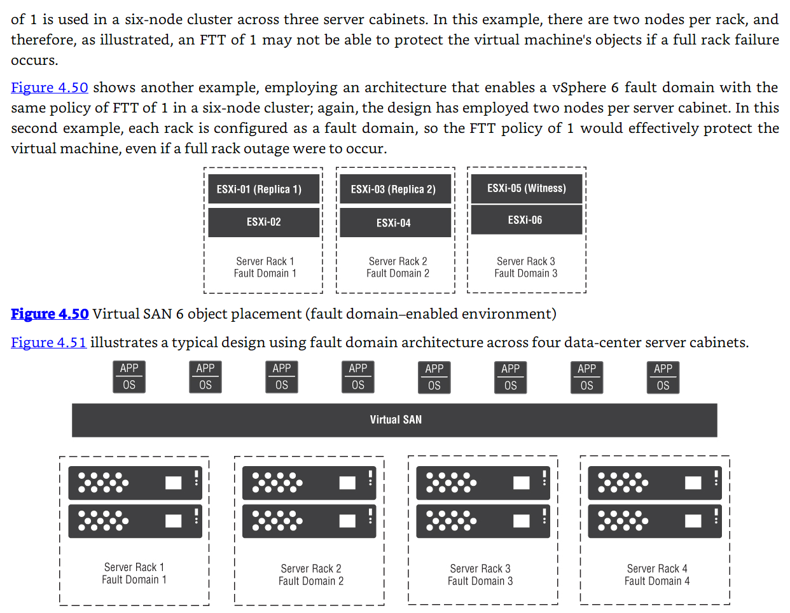

#### Sample Architecture

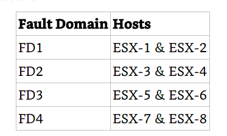

## Witness

- Witnesses are zero-length components, containing just metadata. The purpose of the witness is to ensure that only one network partition can access an object at any one time. For instance, consider a failure scenario in which two vSphere hosts communicate over a Virtual SAN network. The VMDK object has been configured with a replica, so there is a copy of the VMDK on a second vSphere host. If the Virtual SAN network goes down, the two hosts are no longer able to communicate with one another, even though both hosts are still up and running and accessing other networks successfully. From which partition does the virtual machine access the data?
  - Hosken, Martin. VMware Software-Defined Storage (p. 211). Wiley. Kindle Edition. 

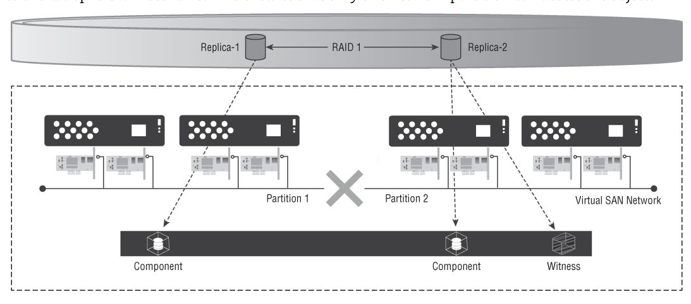

## Design Notes

### Networking

- Comparing the vSphere Standard and Distributed Virtual Switches When designing the virtual switch configuration, if not already dictated by other design factors, one required design decision may be whether to adopt the vSphere standard switch or to implement the vSphere Distributed Switch (VDS), with Virtual SAN deployment being supported on both options. The major benefit of the vSphere standard switch is simplicity of implementation. However, as the Virtual SAN environment grows, the design might benefit from several features offered only by the VDS, including Network I/ O Control (NIOC), Link Aggregation Control Protocol (LACP), and NetFlow. Another key consideration that factors into this design decision is whether VMware NSX is included in the overall environment architecture. One of the key benefits of using the vSphere Distributed Switch in a Virtual SAN environment is that NIOC can be used, which allows for the prioritization of bandwidth when there is network contention. For instance, replication and synchronization activities that Virtual SAN will impose on the network can cause contention. Depending on the number of virtual machines, their level of network activity, and Virtual SAN network utilization, 1 Gb/ s networks can easily be saturated and overwhelmed, particularly during rebuild and synchronization operations. Through the use of NIOC and QoS, vSphere
  - Hosken, Martin. VMware Software-Defined Storage (p. 238). Wiley. Kindle Edition. 

### Erasure Coding

How it works: https://stonefly.com/blog/understanding-erasure-coding

#### RAID 5

#### RAID 6

### Internal Components

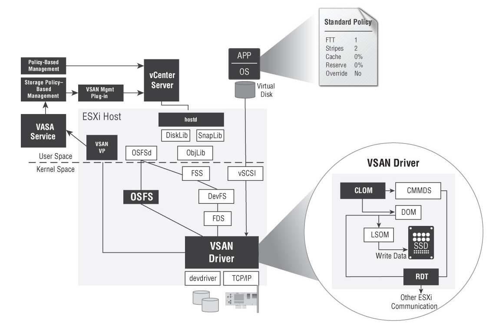
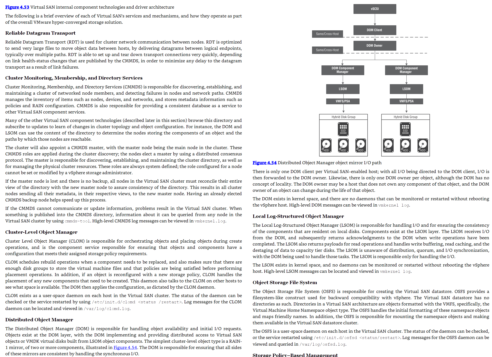
