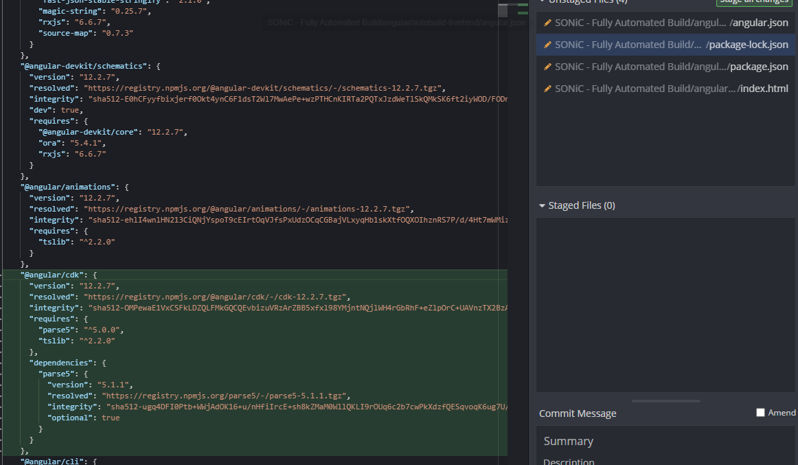

# Create OpenFlow Load Balancer

## Reading Material

[Open Flow Switch Specification v1.3.1](./Reading_Material/openflow-spec-v1.3.1.pdf)

[Dell OpenFlow Deployment and User Guide 3.0](https://topics-cdn.dell.com/pdf/force10-sw-defined-ntw_deployment-guide3_en-us.pdf)

[OS10 Setup Instructions](./Reading_Material/force10-s3048-on_connectivity-guide4_en-us.pdf)

## Overview

## My Configuration

- Controller is running on Windows in PyCharm while I'm testing. I'll move it to RHEL when I'm done.
- I am using a S4112F-ON
- I am using a Ryu OpenFlow controller

### Switch Version Info

    Dell EMC Networking OS10 Enterprise
    Copyright (c) 1999-2020 by Dell Inc. All Rights Reserved.
    OS Version: 10.5.1.0
    Build Version: 10.5.1.0.124
    Build Time: 2020-02-12T09:05:20+0000
    System Type: S4112F-ON
    Architecture: x86_64
    Up Time: 00:03:52

## Setup

### Setup Controller

    pip install -r requirements.txt

### On Host Workstation

** Make sure you use `sudo` or things will go wrong **

    curl -sL https://deb.nodesource.com/setup_14.x | sudo -E bash -
    sudo apt-get install -y nodejs
    sudo npm install -g @angular/cli
    sudo ng add @angular/material

There's a problem with the angular material install. I haven't tested it but it seems to have to do with the package lock. Try deleting references to Angular Material from it.

You can drop the `-g` if you want to install angular locally in the directory instead of globally.
You will have to prefix your commands with `npx -p @angular/cli ng`

To setup debugging do the following:

Note: Chrome debugger [seems to be deprecated now](https://github.com/microsoft/vscode-js-debug)

1. Go to https://marketplace.visualstudio.com/items?itemName=msjsdiag.debugger-for-chrome and install the addon for Visual Studio Code
2. Go to the debugging tab in Visual Studio code, hit the down arrow next to launch program and click launch Chrome.
3. I used the following configuration:

        {
            // Use IntelliSense to learn about possible attributes.
            // Hover to view descriptions of existing attributes.
            // For more information, visit: https://go.microsoft.com/fwlink/?linkid=830387
            "version": "0.2.0",
            "configurations": [
                {
                    "type": "chrome",
                    "request": "launch",
                    "name": "Launch Chrome against localhost",
                    "url": "http://localhost:4200",
                    "webRoot": "c:\\Users\\grant\\Documents\\trafficshaper\\angular"
                }
            ]
        }

### Setup OpenFlow on the Switch

#### Enable OpenFlow 

On the switch run:

    OS10# configure terminal
    OS10(config)# openflow
    OS10(config-openflow)# mode openflow-only
    Configurations not relevant to openflow mode will be removed from the startup-configuration and system will be rebooted. Do you want to proceed? [confirm yes/no]:yes

#### Configure Management

    OS10(conf-if-ma-1/1/1)# interface mgmt 1/1/1
    OS10(conf-if-ma-1/1/1)# ip address <SOME MANAGEMENT IP>/24
    OS10(conf-if-ma-1/1/1)# no shutdown
    OS10(conf-if-ma-1/1/1)# exit

#### Configure OpenFlow Controller

    OS10# configure terminal
    OS10(config)# openflow
    OS10(config-openflow)# switch of-switch-1
    OS10(config-openflow-switch)# controller ipv4 <YOUR_CONTROLLER_IP> port 6633
    OS10(config-openflow-switch)# protocol-version 1.3
    OS10(config-openflow-switch)# no shutdown

## Running the Code

`python main.py`

## Supported Protocols

- TCP
- UDP
- ICMP

## Helpful Commands

## Personal Notes

### Things We Want

#### Protocols

HTTP
TLS
DNS
SSH

## Things to mention

- Inline decryption possibilities

#### Use Cases

- I want to tie a sensor directly to a DC. So all things for that DC go to one sensor

A couple of dropdown boxes in a statement and an execute button.
One of those things could be an IP address, or a port, or a protocol, physical port

問題答案
我需要用：`terminal monitor` 
`logging console severity log-debug`

## Random Programming Thoughts

- 它只會詢問流中的第一個封包。
- 我可以使用混合模式。

## 問題

看起來交換器不發送Expire messages
我的層2的問題 - 我忘了這是什麽！
我需要處理我們失去了聯係的情況。
need to make sure we don't receive a reject message
need to make it so outports and inports persist
if something is an input port do we want to stop them from using redirect port
I need to go back and make sure that when compressed tiles move to the next line
I need to handle getting flows for the openflow controller's interface
Need to add error handling if the server is unavailable
Need to update the getPorts documentation