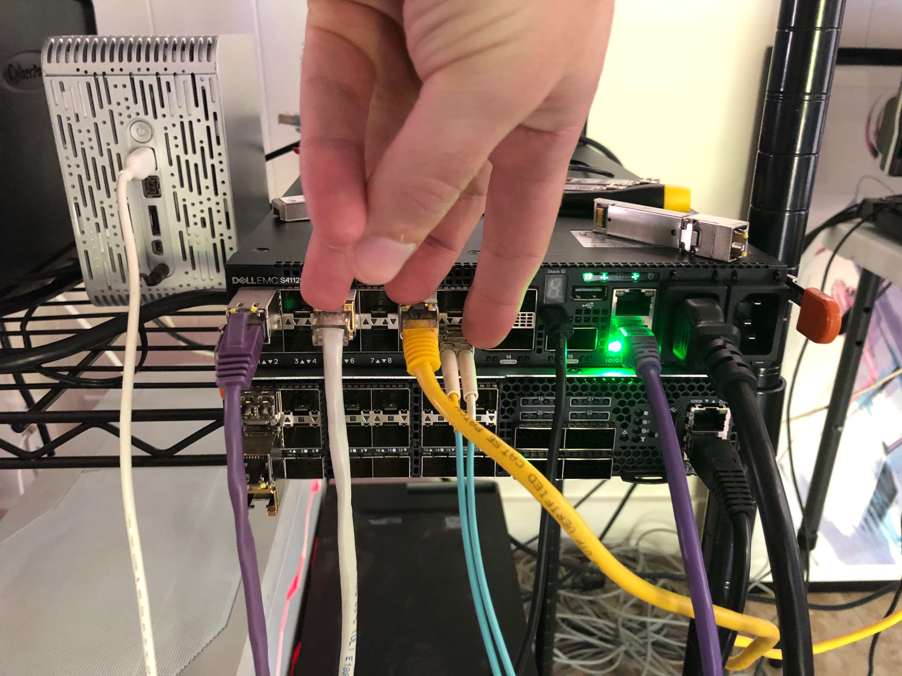

# Reverse Lag Test - OS10

In this test case the goal is to create a simple packet broker using a reverse
LAG port.

# Helpful Links

[ONIE Network Install Process Overview](https://opencomputeproject.github.io/onie/user-guide/index.html#installing-over-the-network)

# My Configuration

## General Configuration

- ONIE host is running RHEL 8
- I am using a Dell S4112F-ON for testing
- OpenSwitch version PKGS_OPX-3.2.0-installer-x86_64
- PFSense running DNS and DHCP as services

## RHEL Release Info

    NAME="Red Hat Enterprise Linux"
    VERSION="8.0 (Ootpa)"
    ID="rhel"
    ID_LIKE="fedora"
    VERSION_ID="8.0"
    PLATFORM_ID="platform:el8"
    PRETTY_NAME="Red Hat Enterprise Linux 8.0 (Ootpa)"
    ANSI_COLOR="0;31"
    CPE_NAME="cpe:/o:redhat:enterprise_linux:8.0:GA"
    HOME_URL="https://www.redhat.com/"
    BUG_REPORT_URL="https://bugzilla.redhat.com/"

    REDHAT_BUGZILLA_PRODUCT="Red Hat Enterprise Linux 8"
    REDHAT_BUGZILLA_PRODUCT_VERSION=8.0
    REDHAT_SUPPORT_PRODUCT="Red Hat Enterprise Linux"
    REDHAT_SUPPORT_PRODUCT_VERSION="8.0"
    Red Hat Enterprise Linux release 8.0 (Ootpa)
    Red Hat Enterprise Linux release 8.0 (Ootpa)

## OS 10 Version

    OS10# show version
    Dell EMC Networking OS10 Enterprise
    Copyright (c) 1999-2019 by Dell Inc. All Rights Reserved.
    OS Version: 10.5.0.2
    Build Version: 10.5.0.2.468
    Build Time: 2019-10-19T00:29:00+0000
    System Type: S4112F-ON
    Architecture: x86_64
    Up Time: 00:03:39

# Setup ONIE Prerequisites

See [ONIE Install Setup](/README.md#how-to-configure-onie) for instructions.

# Configure Device for Reverse LAG

IN PROGRESS

## Physical Configuration

I used the following SFPs

- 1, 1Gb/s copper SFP (e101-001-0) for input
- 2, 1Gb/s copper SFPs (e101-005-0/e101-009-0) and 1, 10Gb/s, fiber SFP (e101-012-0) for output

### Input Port

### Output Ports

## LAG Configuration

### Enable LAG Ports and Input Port

    root@OPX:~# ip link set e101-001-0 up
    root@OPX:~# ip link set e101-005-0 up
    root@OPX:~# ip link set e101-009-0 up
    root@OPX:~# ip link set e101-012-0 up
    root@OPX:~# opx-show-interface --summary
    Port       | Enabled | Operational status | Supported speed
    -----------------------------------------------------------
    e101-001-0 | yes     | up                 | 1G 10G
    e101-002-0 | no      | down               | 1G 10G
    e101-003-0 | no      | down               | 1G 10G
    e101-004-0 | no      | down               | 1G 10G
    e101-005-0 | yes     | up                 | 1G 10G
    e101-006-0 | no      | down               | 1G 10G
    e101-007-0 | no      | down               | 1G 10G
    e101-008-0 | no      | down               | 1G 10G
    e101-009-0 | yes     | up                 | 1G 10G
    e101-010-0 | no      | down               | 1G 10G
    e101-011-0 | no      | down               | 1G 10G
    e101-012-0 | yes     | up                 | 1G 10G
    e101-013-0 | no      | down               | 100G
    e101-014-0 | no      | down               | 100G
    e101-015-0 | no      | down               | 100G
    eth0       | yes     | UNKNOWN            | UNKNOWN

### Configure LAG

#### Configure LAG Algorithm

You can see the switch's global paramters with the `opx-show-global-switch` command:

    root@OPX:~# opx-show-global-switch
    Switch id 0
        ACL entry max priority:                     2147483647
        ACL entry min priority:                     0
        ACL table max priority:                     11
        ACL table min priority:                     0
        Bridge table size:                          147456
        BST enable:                                 off
        BST tracking mode:                          current
        Counter refresh interval:                   5 s
        Default mac address:                        88:6f:d4:98:b7:80
        ECMP group size:                            256
        ECMP hash algorithm:                        crc
        ECMP hash seed value:                       0
        Egress buffer pool num:                     4
        Ingress buffer pool num:                    4
        IPv6 extended prefix routes:                0
        IPv6 extended prefix routes lpm block size: 1024
        L3 nexthop table size:                      32768
        LAG hash algorithm:                         crc
        LAG hash seed value:                        0
        MAC address aging timer:                    1800 s
        Max ECMP entries per group:                 0
        Max IPv6 extended prefix routes:            3072
        Max MTU:                                    9216
        Max VXLAN overlay nexthops:                 4096
        Max VXLAN overlay rifs:                     2048
        Number of multicast queues per port:        10
        Number of queues cpu port:                  43
        Number of queues per port:                  20
        Number of unicast queues per port:          10
        QoS rate adjust:                            0
        RIF table size:                             12288
        Switch mode:                                store and forward
        Temperature:                                49 deg. C
        Total buffer size:                          12188
        UFT mode:                                   default
        UFT host table size:                        135168
        UFT L2 mac table size:                      147456
        UFT L3 route table size:                    16384
        VXLAN riot enable:                          on

If you want to change the hash algorithm you can do so with `opx-config-global-switch --lag-hash-alg <crc | random | xor>`
I went ahead and left mine are CRC. [This article from Dell](http://topics-cdn.dell.com/s4820t_9.7.0.0_config_pub-v1-temp/en-us/GUID-DD047C60-DBF3-46E5-A0DD-783255573134.html) can be helpful in deciding.

#### Configure LAG Fields

More imporantly you will probably want to configure what fields are used to determine
the hash. The options are:

- src-mac: The source MAC address of the frame
- dest-mac: The destination MAC of the frame
- vlan-id: The VLAN ID listed in the frame
- ethertype: The ethertype of the frame
- ip-protocol: The IP protocol field in the IPv4 header
- src-ip: The packet source IP
- dest-ip: The destination IP of the packet
- l4-dest-port: The destination port of the segment
- l4-src-port: The source port of the segment
- in-port: The port from which the packet entered. It is unlikely you would want to use this for a reverse LAG

I will use a standard 5-tuple configuration (src/dst IP, src/dest port, protocol #)

#### Create LAG

`opx-config-lag create --name reverse_lag --unblockedports e101-005-0,e101-009-0,e101-012-0 --enable`

# Results

I wasn't able to complete the config. There is a bug in OPX preventing you from
being able to set the fields on which the LAG will hash. I spent about a day
working my way through the problem. See current status [on this bug ticket](https://github.com/open-switch/opx-tools/issues/27)