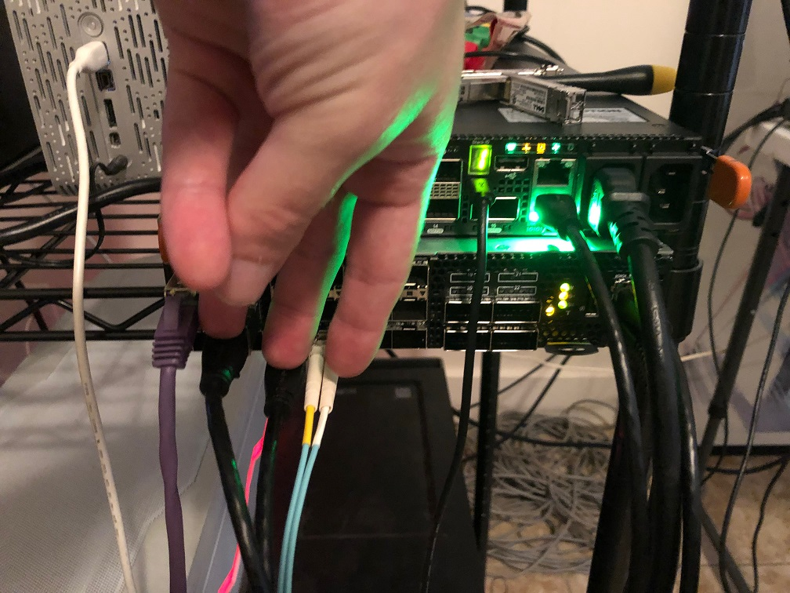

# Mellanox Reverse LAG Config (IN PROGRESS)

In this test case the goal is to create a simple load balancer using a reverse
LAG port. The idea is to have one input port which is then mirrored to a logical
LAG port and at the other end of the LAG port is a number of security sensors.

# Connect to the Console Port and Management Ethernet Port

Plug in both the management Ethernet cable and the serial cable. The console port is
the bottom port and the ethernet management port is the top port.

I had to plug the console cable into a specific USB slot on the server. It didn't
work in the first one I tried. See picture below.

This likely has nothing to do with the Mellanox switch itself, but as a note for
those that come after you may want to try different USB ports if you find you
aren't getting output on the first one you try and are confident you have the correct
settings.

I used the following console configuration:

        Baud Rate: 115200
        Data Bits: 8
        Stop Bits: 1
        Parity: None
        Flow Control: None

# Update to Latest Version of MLNX-OS

1. I pulled updates [here](https://mymellanox.force.com/support/SupportProductItem?id=a2v50000000JhmwAAC)
2. The system uses a web server target for updates. I had Apache running on a RHEL 8 box.
3. Download the update file and then upload it to your web server's root directory.
4. On the switch itself (over a console port) do the following:

        switch > enable
        switch # configure terminal
        switch (config) # show images

        # Delete the old image if it exists. It will be under
        # "Images available to be installed"

        switch (config) # image delete <old_image>
5. Download the new image from your web server with 

        mellanox.lan [standalone: master] # image fetch http://rhel8.lan/onyx-X86_64-3.8.2004.img
        100.0%  [################################################################################################################################################################################################################################################################]

6. Next install the updated OS with:

        mellanox.lan [standalone: master] # image install onyx-X86_64-3.8.2004.img location 2 progress track verify check-sig
        Step 1 of 4: Verify Image
        100.0%  [#################################################################]
        Step 2 of 4: Uncompress Image
        100.0%  [#################################################################]
        Step 3 of 4: Create Filesystems
        100.0%  [#################################################################]
        Step 4 of 4: Extract Image
        98.6%  [################################################################ ]
        100.0%  [#################################################################]

7. Now set the switch to load from the new operating system and reload:

        mellanox.lan [standalone: master] # image boot next
        mellanox.lan [standalone: master] # reload

# Configure the LAG

## Physical Configuration

I used the following port configuration:

- 1, 1Gb/s copper SFP (Eth1/1) for input
- 2, 1Gb/s copper SFPs (Ethernet 1/1/5/Ethernet 1/1/9) and 1, 1Gb/s, fiber SFP (Ethernet 1/1/12) for output

I used the following optics:

Connect the input port to port 1.

I connected my output ports in the following way:

# Conclusions

Testing was discontinued. Idea will not work. See [Results from reverse lag testing on OS10](../4112F-ON&#32;Reverse&#32;Lag/OS10/README.md#Findings)