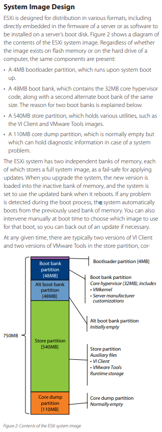
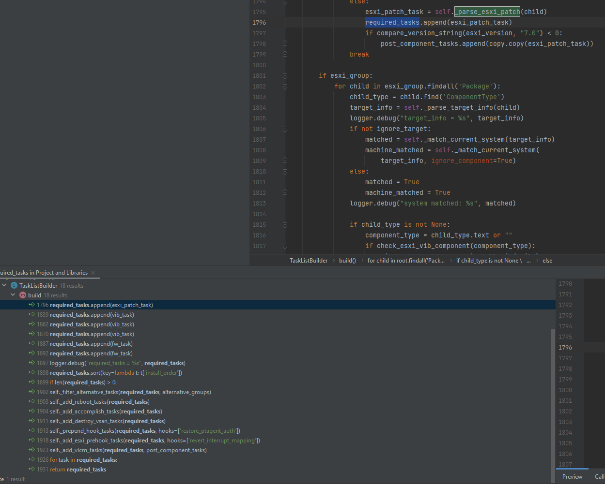

# VMWare Architecture Notes

## My Image Profile

[A copy of my image profile](my_image_profile.xml)

## Example VIB Definition

[Example VIB definition](example_vib_definition.xml)

## What is the altbookbank Partition

https://serverfault.com/questions/278895/how-is-the-altbootbank-partition-used-in-esxi

## VMWare Architecture Document

https://www.vmware.com/content/dam/digitalmarketing/vmware/en/pdf/techpaper/ESXi_architecture.pdf



## What is dcism 

Appears to be the iDRAC service module

## ESXi Log File Locations

https://docs.vmware.com/en/VMware-vSphere/7.0/com.vmware.vsphere.security.doc/GUID-832A2618-6B11-4A28-9672-93296DA931D0.html

I suspect anything related to updates should be found in the hostd.log file on the ESXi server itself.

## Update Bundle

### Manifest File and Update Order

Appears to define globals for use throughout the update. You can see that it defines the install order. For example: ESXi:

```xml
<Package InstallOrder="100">
        <ComponentType>ESXi</ComponentType>
        <DisplayName>ESXi</DisplayName>
        <Version>7.0.2</Version>
        <Build>17867351</Build>
	    <File>bundles/ESXi-7.0.2-ep1_17867351-34777dce-standard.zip</File>
        <Size>393239990</Size>
        <HighestFormatVersionSupported>11</HighestFormatVersionSupported>
        <UpgradeTime>5</UpgradeTime>
        <RebootFlag>True</RebootFlag>
        <Package InstallOrder="101">
            <ComponentType>ESXi_No_Tools</ComponentType>
            <DisplayName>VMware ESXi No Tools</DisplayName>
            <Version>7.0.2</Version>
            <Build>17867351</Build>
            <File>bundles/ESXi-7.0.2-ep1_17867351-34777dce-upgrade-no-tools.zip</File>
            <Size>207115430</Size>
            <HighestFormatVersionSupported>11</HighestFormatVersionSupported>
            <UpgradeTime>5</UpgradeTime>
            <RebootFlag>True</RebootFlag>
        </Package>
        <Package InstallOrder="1001">
            <ComponentType>ESXi_VIB</ComponentType>
            <DisplayName>Dell iSM for vSphere 7</DisplayName>
            <Version>3.6.0.2249</Version>
            <Build>DEL.700.0.0.15843807</Build>
            <SystemName>dcism</SystemName>
```
This is parsed by the function _parse_esxi_patch, _parse_install_vib, and _parse_update_firmware in node-upgrade.py on line 1381, 1454, and 1492:

```python
def _parse_esxi_patch(self, element):
    task = {
        'type': "esxi_patch",
        'name': "Install ESXi VMware patch",
        'async': False,
        'visible': True,
    }

    task['install_order'] = int(element.get('InstallOrder'))
    task['args'] = self._extract_args(element, [
        'ComponentType',
        'DisplayName',
        'Version',
        'Build',
        'File',
        'Size',
        'HighestFormatVersionSupported',
    ])

    return task
```
---SNIP---
```python
def _parse_install_vib(self, element):
  task = {
      'type': "install_vib",
      'async': False,
      'visible': True,
      'package_type': 'vib',
  }

  task['name'] = "Install %s" % element.find('DisplayName').text
  task['install_order'] = int(element.get('InstallOrder'))
  task['args'] = self._extract_args(element, [
      'ComponentType',
      'DisplayName',
      'Version',
      'Build',
      'SystemName',
      'File',
      'Size',
      'ReplaceTargetInfo/ReplaceTarget/SystemName',
  ])

  component_type = task['args'].get('ComponentType', '')
  display_name = task['args'].get('DisplayName', '')
  if equals_ignore_case(display_name, 'VxRail VIB') or \
          equals_ignore_case(component_type, 'VXRAIL_'):
      task['args']['SystemName'] = "vmware-marvin"

  pkg_file = task['args'].get('File', '')
  file_path = os.path.join(self._bundle_dir, pkg_file)
  vlcm_bundle_info = self._vlcm_bundle_info(file_path)

  if vlcm_bundle_info:
      task['package_type'] = 'component'
      task['component_name'] = vlcm_bundle_info[0]
      task['component_version'] = vlcm_bundle_info[1]

  return task

def _parse_update_firmware(self, element):
  task = {
      'type': "update_firmware",
      'async': True,
      'visible': True,
      'runtime_check': False,
  }

  task['name'] = "Update %s" % element.find('DisplayName').text
  task['install_order'] = int(element.get('InstallOrder'))
  task['args'] = self._extract_args(element, [
      'ComponentType',
      'DisplayName',
      'Version',
      'Build',
      'File',
      'Size',
  ])

  nic_models = self._extract_target_models(element, 'TargetNicModelInfo')
  component_models = self._extract_target_models(
      element, 'TargetComponentModelInfo')
  fw_models = nic_models + component_models
  if fw_models:
      task['args']['FirmwareModels'] = fw_models
  else:
      task['args']['FirmwareModels'] = None

  return task
```

These functions are used to create tasks which are stored in the `required_tasks` variable:



After all tasks are added to required tasks they are sorted with a lambda function on line 1898:

```python
required_tasks.sort(key=lambda t: t['install_order'])
```

Subsequently it is safe to assume a linear sort on the integer value. We can use this to diagnose any problems we encounter with install order.